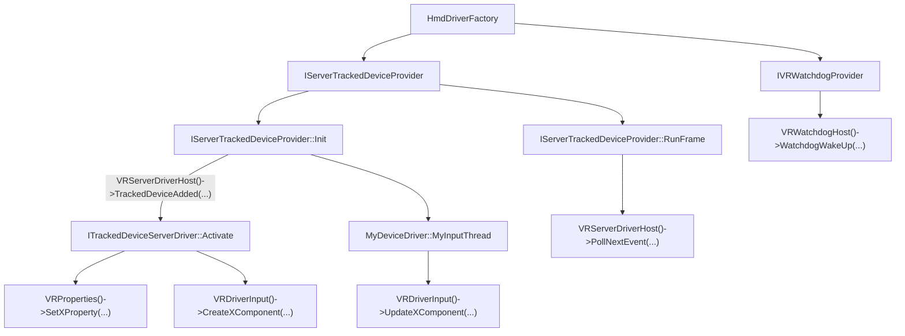

# OpenVR Driver Documentation

- [OpenVR Driver Documentation](#openvr-driver-documentation)
    - [About](#about)
    - [Overview & Important points](#overview--important-points)
        - [Using interfaces implemented by the runtime](#using-interfaces-implemented-by-the-runtime)
        - [Import interfaces and functions](#import-interfaces-and-functions)
    - [Driver Folder Structure](#driver-folder-structure)
    - [Driver files](#driver-files)
        - [driver.vrdrivermanifest](#drivervrdrivermanifest)
        - [resources/driver.vrresources](#resourcesdrivervrresources)
            - [Example](#example)
        - [localization/localization.json](#localizationlocalizationjson)
            - [Defining localization in one file](#defining-localization-in-one-file)
            - [Defining localization in multiple files](#defining-localization-in-multiple-files)
        - [resources/settings/default.vrsettings](#resourcessettingsdefaultvrsettings)
            - [Example](#example)
    - [Icons](#icons)
        - [Setting icons](#setting-icons)
        - [Updating Icons](#updating-icons)
    - [Device Classes](#device-classes)
        - [Controller roles](#controller-roles)
        - [Trackers (Full body Tracking)](#trackers-full-body-tracking)
- [Driver Structure](#driver-structure)
    - [HmdDriverFactory](#hmddriverfactory)
    - [IServerTrackedDeviceProvider](#iservertrackeddeviceprovider)
        - [Example](#example)
    - [ITrackedDeviceServerDriver](#itrackeddeviceserverdriver)
        - [Device Components](#device-components)
            - [IVRDisplayComponent](#ivrdisplaycomponent)
            - [IVRDriverDirectModeComponent](#ivrdriverdirectmodecomponent)
            - [IVRVirtualDisplay](#ivrvirtualdisplay)
    - [IVRServerDriverHost](#ivrserverdriverhost)
    - [IVRDriverLog](#ivrdriverlog)
    - [IVRWatchdogProvider](#ivrwatchdogprovider)
        - [The watchdog interface is deprecated and should no longer be used for new projects.](#the-watchdog-interface-is-deprecated-and-should-no-longer-be-used-for-new-projects)
        - [IVRWatchdogHost](#ivrwatchdoghost)
    - [Device Inputs](#device-inputs)
        - [Input Profiles](#input-profiles)
            - [Input sources](#input-sources)
        - [Input Profile JSON](#input-profile-json)
            - [Reserved input sources](#reserved-input-sources)
    - [Binding Profiles](#binding-profiles)
        - [Default Bindings](#default-bindings)
    - [Driver Input](#driver-input)
        - [Creating Components](#creating-components)
        - [Updating Components](#updating-components)
    - [Events](#events)
        - [Haptic Events](#haptic-events)
    - [Device Properties](#device-properties)
        - [Implementing Properties](#implementing-properties)
        - [IVRProperties](#ivrproperties)
        - [CVRPropertyHelpers](#cvrpropertyhelpers)
            - [Getting properties](#getting-properties)
            - [Setting Properties](#setting-properties)
            - [Property Utilities](#property-utilities)
    - [IVRSettings](#ivrsettings)
    - [IVRResources](#ivrresources)
    - [IVRDriverSpatialAnchors](#ivrdriverspatialanchors)
    - [Poses](#poses)
    - [Skeletal Input](#skeletal-input)
        - [Notes on hand tracking compatibility](#notes-on-hand-tracking-compatibility)
        - [The Skeleton](#the-skeleton)
        - [Units and Coordinate System](#units-and-coordinate-system)
        - [Bone Structure](#bone-structure)
            - [Notes on the skeleton](#notes-on-the-skeleton)
        - [Using Skeletal Input](#using-skeletal-input)
            - [Creating Hand Animations](#creating-hand-animations)
    - [Application Compatibility](#application-compatibility)
        - [Automatic Rebinding](#automatic-rebinding)
            - [File Structure](#file-structure)
            - [One-to-Many Remappings](#one-to-many-remappings)
            - [Examples](#examples)
        - [Emulating Devices in Bindings](#emulating-devices-in-bindings)
            - [SteamVR Input and Legacy Input](#steamvr-input-and-legacy-input)
            - [OpenXR](#openxr)
        - [Legacy Binding Simulation](#legacy-binding-simulation)
        - [Binding Duplication](#binding-duplication)
        - [Emulateable Devices](#emulateable-devices)
    - [Render Models](#render-models)
    - [Chaperone](#chaperone)
    - [Building & Development Environment](#building--development-environment)
        - [Debugging SteamVR with Visual Studio](#debugging-steamvr-with-visual-studio)
- [Further Examples](#further-examples)

## About

OpenVR provides a driver interface for hardware to interact with SteamVR and OpenVR-supported applications.  
The interface is **device-agnostic**: applications do not need to provide explicit support for your hardware, and so
long as you conform to the OpenVR driver API, your devices will be supported in SteamVR games.

It's important to note that OpenVR **does not** provide definitions for the functions it declares. These functions are
implemented into SteamVR, or any other conformant OpenVR *runtime*.

SteamVR is backwards compatible with previous versions of OpenVR. If OpenVR
interfaces were to be updated, a driver or application developer need not update their software, as it is guaranteed to
continue to be supported.

The documentation provides an overview of common interfaces and use cases for setting up a driver.

## Overview & Important points

The available interfaces in the OpenVR Driver API can be found
in [openvr/headers/openvr_driver.h](https://github.com/ValveSoftware/openvr/blob/master/headers/openvr_driver.h).

Sample drivers can be found in `samples/drivers`.

### Using interfaces implemented by the runtime

Some interfaces in the OpenVR Driver API are implemented already by the runtime. You **must not** implement
these interfaces yourself, but you **can** call the methods they contain. These interfaces include:

* `IVRSettings`
* `IVRProperties`
* `CVRPropertyHelpers`
* `CVRHiddenAreaHelpers`
* `IVRDriverLog`
* `IVRServerDriverHost`
* `IVRWatchdogHost`
* `IVRCompositorDriverHost`
* `DriverHandle_t`
* `IVRDriverManager`
* `IVRResources`
* `IVRDriverInput`
* `IVRIOBuffer`
* `IVRDriverSpatialAnchors`

The OpenVR Driver API provides utility functions to retrieve pointers to these objects. They are functions of
the same name as the interface, without the `I` prefix. For example: `vr::VRServerDriverHost()` returns a valid pointer
to an `IVRServerDriverHost` implemented in the runtime.

```c++
IVRDriverLog* log = vr::VRDriverLog();
IVRSettings* settings = vr::VRSettings();

// Some of these methods return pointers to wrappers around the origin classes to help simplify them
CVRPropertyHelpers* properties = vr::VRProperties();
```

### Import interfaces and functions

This section provides a short introduction to what the code that you will be writing for your driver will look like.
This section **does not** provide documentation on the interfaces, but a brief overview of what you'll be writing will
look like.

The flow typically looks like this. Documentation on each of these classes and methods are outlined elsewhere.



## Driver Folder Structure

    <driver_name>
    ├── bin                                          # Contains all binary files
    │   ├── win64   
    │   │   └── driver_<driver_name>.dll             # Driver binary. The name MUST follow the driver_<driver_name>.dll pattern in order for it to be loaded
    │   └── ...
    ├── resources                                    # Contains all resource files
    │   ├── icons
    │   │   ├── <my_device_status>.png               # Device status & binding icons.
    │   │   └── ...
    │   ├── input
    │   │   ├── <my_controller>_profile.json         # Input profile for device
    │   │   └── legacy_binding_<my_controller>.json  # Legacy binding file for your device
    │   ├── localization
    │   │   ├── localization.json                    # Localized strings that will appear in places such as the bindings configuration interface.
    │   │   └── locatization_<lang>.json             # Optional: specify localization languages in different files 
    │   ├── settings
    │   │   └── default.vrsettings                   # Default Driver settings
    │   └── driver.vrresources                       # Defines resources for the driver's devices, such as icons
    └── driver.vrdrivermanifest                      # Manifest file that identifies the location of the driver binaries (relative to the manifest file) and several other attributes of the driver.

<br />

`<driver_name>` **should** be a non-whitespace, lowercase string giving the name of your driver.

`<driver_name>` **must** be the same between the name of the driver binary file, and the root folder name.

- Inconsistent naming **will** result in SteamVR returning `VRInitError_Init_FileNotFound` when attempting to load the
  driver.

## Driver files

SteamVR uses the JSON format for many of its configuration files. Files containing invalid JSON (such as trailing
commas), **will**
cause the runtime to fail to load the files.

### driver.vrdrivermanifest

The `driver.vrdrivermanifest` is a **required** file that lives in the **root** of the driver folder.

It contains information relating to attributes of your driver.

* `name` - The globally-unique name of the driver. The name **must** match the root folder name (the folder that
  contains the `driver.vrdrivermanifest`). The driver DLL(s) **must** also be called `driver_<name>.dll` (or the
  equivalent
  extension for other platforms).
* `directory` - The name of the directory that contains the rest of the driver files. If this is a relative path it is
  relative to the directory that contains `driver.vrdrivermanifest`. Defaults to the full path contains
  `driver.vrdrivermanifest`.
* `alwaysActivate` - If this is true this driver will be activated even if the active HMD is from another driver.
  Defaults to false.
    - A driver that exposes *only* controllers, **should** set this to true if it is known that the HMD may be from a
      different tracking system.
* `resourceOnly` - The driver contains a `resources` directory, but not any binaries. This is used for
  *lighthouse-tracked devices*, which define driver behaviour and inputs through a JSON file. See `The JSON File` for
  information.
* `hmd_presence` - This is an array of strings that identify the USB VID and PID combinations that indicate an HMD from
  this driver is probably present. Each entry **should** be hex values in this form:
    * `28DE.*` - Any USB device with a VID of 28DE will cause OpenVR to return true from `VR_IsHmdPresent`.
    * `28DE.2000` - Any USE device with a VID of 28DE and a PID of 2000 will cause OpenVR to return true
      from `VR_IsHmdPresent`.
    * `*.*` - The runtime **will** always return true from `VR_IsHmdPresent` if this driver is installed.
* `other_presence` - An array of strings in the same format as hmd_presence that indicates that there is a non-HMD
  device plugged in.
* `redirectsDisplay` - Whether the device implements `vr::TrackedDeviceClass_DisplayRedirect` devices.
  See [IVRVirtualDisplay](#ivrvirtualdisplay) for more details.
* `prefersUpperDeviceIndices` - Whether the device should be activated with a higher index. This will make it a lower
  priority for being set in an active role. Defaults to false.
* `spatialAnchorsSupport` - Whether the device supports [Spatial Anchors](#ivrdriverspatialanchors). Defaults to false.
  Without this, SteamVR **will** short-circuit anchor requests from applications and provide a generic descriptor that
  does not have any of the advantages of true spatial anchors.

The sample `driver.vrdrivermanifest` looks like this:

```json
{
  "alwaysActivate": false,
  "name": "barebones",
  "directory": "",
  "resourceOnly": false,
  "hmd_presence": [
    "*.*"
  ]
}
```

See `samples/drivers/barebones` for a full example.

### resources/driver.vrresources

The `driver.vrresources` file is an optional file that lives in the `resources/` folder.

It contains information relating to the external resources of your driver such as icons.
These icons are displayed in the SteamVR monitor window while SteamVR is running
and convey icon-representations of the current status of your devices.

See [Icons](#icons) for how these icons should be formatted.

`driver.vrresources` contains the following keys:

* `jsonid` - Required. The value of this **must** be `vrresources` for this file.
* `statusicons` - Optional. Used to define icons for specific device types
    * `<model_number>` - The `Prop_ModelNumber_String` of the device you want to define icons for.
      See [Device Properties](#Device-Properties) for setting this property.
        * `<icon_name>` - The name of the icon to provide the path to. A list of possible keys for the names of icons
          are listed in [Setting Icons](#setting-icons).
            * Values of `<icon_name>` represent the path to an image file. File paths **can** use the `{<driver_name>}`
              wildcard format to match the root path to the driver. For
              example: `{my_driver}/resources/icons/my_image.png`.
            * See [Icons](#icons) for more information on how the icons should be formatted.
            * If a key is not specified, the `{system}/icons/invalid_status.png` icon **will** be used.
        * `Alias` - a reserved key for chaining through different model number icons (see example).
            * Icon name keys that are not found in the original section will chase through to the section specified by
              the value of the `Alias` key.
            * This is useful for different model numbers that might have the same icons for some images, but not others,
              and this allows the driver to avoid duplication by providing a "common" icon section.

If `Prop_ModelNumber_String` is not matched, a fallback considers the following child keys of `statusicons`:

* `HMD` - Considered for driver devices of class `TrackedDeviceClass_HMD`. See [Device Classes](#device-classes) for
  more
  information.
* `<Left/Right>Controller` - Considered for driver devices of class `TrackedDeviceClass_Controller`.
  See [Device Classes](#device-classes) for more information.
    - If `<Left/Right>` is omitted, a fallback to `Controller` is considered. However, this means that the user won't be
      able to identify which icon represents the left/right hand.
* `GenericTracker` - Considered for driver devices of class `TrackedDeviceClass_GenericTracker`.
  See [Device Classes](#device-classes) for more information.
* `TrackingReference` - Considered for driver devices of class `TrackedDeviceClass_TrackingReference`.
  See [Device Classes](#device-classes) for more information.

If these are not matched, the runtime **will** fallback to generic icons specified under these same keys
in `system.vrresources`.

#### Example

```json
{
  "jsonid": "vrresources",
  "statusicons": {
    "HMD": {
      "Prop_NamedIconPathDeviceOff_String": "{sample}/icons/headset_sample_status_off.png",
      "Prop_NamedIconPathDeviceSearching_String": "{sample}/icons/headset_sample_status_searching.gif",
      "Prop_NamedIconPathDeviceSearchingAlert_String": "{sample}/icons/headset_sample_status_searching_alert.gif",
      "Prop_NamedIconPathDeviceReady_String": "{sample}/icons/headset_sample_status_ready.png",
      "Prop_NamedIconPathDeviceReadyAlert_String": "{sample}/icons/headset_sample_status_ready_alert.png",
      "Prop_NamedIconPathDeviceNotReady_String": "{sample}/icons/headset_sample_status_error.png",
      "Prop_NamedIconPathDeviceStandby_String": "{sample}/icons/headset_sample_status_standby.png",
      "Prop_NamedIconPathDeviceAlertLow_String": "{sample}/icons/headset_sample_status_ready_low.png"
    },
    "Model-v Defaults": {
      "Prop_NamedIconPathDeviceOff_String": "{sample}/icons/headset_sample_status_off.png",
      "Prop_NamedIconPathDeviceSearching_String": "Prop_NamedIconPathDeviceOff_String",
      "Prop_NamedIconPathDeviceSearchingAlert_String": "Prop_NamedIconPathDeviceOff_String",
      "Prop_NamedIconPathDeviceReady_String": "Prop_NamedIconPathDeviceOff_String",
      "Prop_NamedIconPathDeviceReadyAlert_String": "Prop_NamedIconPathDeviceOff_String",
      "Prop_NamedIconPathDeviceNotReady_String": "Prop_NamedIconPathDeviceOff_String",
      "Prop_NamedIconPathDeviceStandby_String": "Prop_NamedIconPathDeviceOff_String",
      "Prop_NamedIconPathDeviceAlertLow_String": "Prop_NamedIconPathDeviceOff_String"
    },
    "Model-v1.0": {
      "Alias": "Model-v Defaults",
      "Prop_NamedIconPathDeviceAlertLow_String": "{sample}/icons/headset_model1_alertlow.png"
    },
    "Model-v2.0": {
      "Alias": "Model-v1.0",
      "Prop_NamedIconPathDeviceAlertLow_String": "{sample}/icons/headset_model2_alertlow.png"
    },
    "LeftController": {
      "Prop_NamedIconPathDeviceOff_String": "{sample}/icons/controller_status_off.png",
      "Prop_NamedIconPathDeviceSearching_String": "{sample}/icons/controller_status_searching.gif",
      "Prop_NamedIconPathDeviceSearchingAlert_String": "{sample}/icons/controller_status_searching_alert.gif",
      "Prop_NamedIconPathDeviceReady_String": "{sample}/icons/controller_status_ready.png",
      "Prop_NamedIconPathDeviceReadyAlert_String": "{sample}/icons/controller_status_ready_alert.png",
      "Prop_NamedIconPathDeviceNotReady_String": "{sample}/icons/controller_status_error.png",
      "Prop_NamedIconPathDeviceStandby_String": "{sample}/icons/controller_status_standby.png",
      "Prop_NamedIconPathDeviceAlertLow_String": "{sample}/icons/controller_status_ready_low.png"
    },
    "RightController": {
      "Prop_NamedIconPathDeviceOff_String": "{sample}/icons/controller_status_off.png",
      "Prop_NamedIconPathDeviceSearching_String": "{sample}/icons/controller_status_searching.gif",
      "Prop_NamedIconPathDeviceSearchingAlert_String": "{sample}/icons/controller_status_searching_alert.gif",
      "Prop_NamedIconPathDeviceReady_String": "{sample}/icons/controller_status_ready.png",
      "Prop_NamedIconPathDeviceReadyAlert_String": "{sample}/icons/controller_status_ready_alert.png",
      "Prop_NamedIconPathDeviceNotReady_String": "{sample}/icons/controller_status_error.png",
      "Prop_NamedIconPathDeviceStandby_String": "{sample}/icons/controller_status_standby.png",
      "Prop_NamedIconPathDeviceAlertLow_String": "{sample}/icons/controller_status_ready_low.png"
    }
  }
}
```

### localization/localization.json

The localization JSON file specifies localization information for the device.

Drivers **can** either choose to create new files *for each* localized version, or define them all
in `localization/localization.json`

This file is also used for providing *user-friendly* names for the devices. For
example, `Prop_RegisteredDeviceType_String` for the Index Controllers are `knuckles`. These are then localized
in English to `Index Controller`.

The keys **can** define localized versions for whatever is exported from your driver through its visible properties (
e.g. `Prop_RegisteredDeviceType_String`).

#### Defining localization in one file

`localization/localization.json` **must** contain a JSON-formatted array, containing objects for each localized version.
This object **must** contain:

* `language_tag`: a recognized language tag, e.g `en_US`.

And any strings the driver exports that the driver wishes to be localized.

```json
[
  {
    "language_tag": "en_US",
    "knuckles": "Index Controller",
    "knuckles_ev1": "Knuckles (EV1) Controller",
    "/input/a": "A Button",
    "/input/b": "B Button",
    "/input/pinch": "Pinch Gesture",
    "/input/finger/index": "Index Finger",
    "/input/finger/middle": "Middle Finger",
    "/input/finger/ring": "Ring Finger",
    "/input/finger/pinky": "Pinky Finger",
    "/input/thumbstick": "Thumb Stick"
  }
]
```

#### Defining localization in multiple files

`localization/localization.json` **must** contain a JSON-formatted object, containing language tag keys for each
localized version.

```json
{
  "en_US": "{<driver_name>}/localization/localization_en_us.json"
}
```

Where `<driver_name>` is the name of the driver. This then expands to an absolute path which the runtime can then load.

Each individual file linked to then **must** be a JSON-formatted object.
This object **must** contain one key:

* `language_tag`: a recognized language tag, e.g `en_us`

```json
{
  "language_tag": "en_US",
  "knuckles": "Index Controller",
  "knuckles_ev1": "Knuckles (EV1) Controller",
  "/input/a": "A Button",
  "/input/b": "B Button",
  "/input/pinch": "Pinch Gesture",
  "/input/finger/index": "Index Finger",
  "/input/finger/middle": "Middle Finger",
  "/input/finger/ring": "Ring Finger",
  "/input/finger/pinky": "Pinky Finger",
  "/input/thumbstick": "Thumb Stick"
}
```

### resources/settings/default.vrsettings

The `default.vrsettings` file provides default settings values for the driver. The file **should not** be modified by
users and should only provide default driver setting values which can then later be configured using the 
[IVRSettings](#ivrsettings) interface. `IVRSettings` writes updated setting values to `steamvr.vrsettings`.

Drivers **should** provide a `default.vrsettings` file to ship with the driver, which **must** be located
in `<driver_name>/resources/settings/default.vrsettings`. This file provides a default set of settings which will be
used if a setting is not found in `steamvr.vrsettings`.

Settings are grouped in driver-defined sections. These sections contain keys and associated setting values. Values can
be strings (maximum 4096 characters), floats, integers, or booleans.

Drivers **should** be careful when choosing names for sections, as they are global and not namespaced to a specific
driver. Drivers **should** prefix their sections with their name to avoid these collisions.

A driver **should** specify at least one _section_ (JSON object in the root of the file), with the key
name `driver_<my_driver_name>`.

While the driver can add any custom keys in this section, there are some keys that are reserved for use by the runtime:

* `enable` - A boolean value that determines whether the driver is enabled or not.
    * This is a special value, and can be modified by the user through the SteamVR settings
      UI (`SteamVR Settings > Startup/Shutdown > Manage addons`).
    * This is defaulted to `true` if not specified.
* `loadPriority` - An integer value that determines the order in which to load drivers.
    * The order of priority is descending (drivers with higher integer `loadPriority` values will be loaded first).
    * This is defaulted to `0` if not specified.
    * All drivers that ship with SteamVR have a `loadPriority` of `0`.
* `blocked_by_safe_mode` - A boolean value that determines whether the driver is blocked from loading when SteamVR is in
  safe mode.
    * This is defaulted to `false` if not specified. This **should** be set to false (so the driver is blocked by safe
      mode) for 3rd party drivers. Having this value set to `true` will mean if the driver is crashing on startup, the
      user will be unable to use SteamVR without uninstalling the driver.

#### Example

```json
{
  "driver_mydriver": {
    "enable": true,
    "loadPriority": 100,
    "blocked_by_safe_mode": false,
    "my_custom_setting": "my_custom_value"
  },
  "driver_mydriver_customsettings": {
    "my_custom_setting2": "my_custom_value2"
  }
}
```

## Icons

If an icon is to be displayed in SteamVR, it **must** be one of the following sizes,
depending on what type of device it is:

* HMD: 50x32 or 100x64 (see below) png/gif
* Other: 32x32 or 64x64 (see below) png/gif

Append `@2x` to the end of the file name to have a 100x64 HMD icon or 64x64 device icon.
Otherwise, a 50x32 or 32x32 icon size **will** be used.

For example:

* `my_hmd_icon.png` - 50x32 icon **must** be used.
* `my_hmd_icon@2x.png` - 100x64 icon **must** be used.

An icon which is not a supported size **will** be cropped from the top-left.

An icon **can** choose to animate using a gif format. For example, it is typical for tracked controllers to have a
breathing animation when they are on, but have not established tracking.

Icons **must** be a colored green-blue gradient across the image. Icons **will** be formatted appropriately to include
this gradient. These gradients are generated by the runtime, and are placed into the same folder
the icon is in, with  `.b4bfb144` appended to the filename.

### Setting icons

To set icons, they **must** be set as a property of the device. This can either be done in
the `driver.vrdrivermanifest` file or through setting the properties programmatically.
See [Device Properties](#device-properties).

A list of icons that **can** be set are defined below:

* `Prop_NamedIconPathDeviceOff_String` - The device is off.
* `Prop_NamedIconPathDeviceSearching_String` - The device is on, but does not have tracking established.
* `Prop_NamedIconPathDeviceSearchingAlert_String` - The device is on, does not have tracking established and has
  received a warning.
* `Prop_NamedIconPathDeviceReady_String` - The device is on, tracking and working nominally.
* `Prop_NamedIconPathDeviceReadyAlert_String` - The device is on and ready to use, but needs to inform the user of
  something (E.g. firmware update).
* `Prop_NamedIconPathDeviceNotReady_String` - The device is on, but not ready to start up and establish tracking.
* `Prop_NamedIconPathDeviceStandby_String` - The device has been put to sleep due to system inactivity.
* `Prop_NamedIconPathDeviceStandbyAlert_String` - The device is in standby, but needs to inform the user of something (
  E.g. firmware update).
* `Prop_NamedIconPathDeviceAlertLow_String` - The device is working, but has a low battery. This is
  when `Prop_DeviceBatteryPercentage_Float` is less than 15%. See [Device Properties](#device-properties).
* `Prop_NamedIconPathTrackingReferenceDeviceOff_String` - The tracking reference device (i.e. basestation) is not yet
  detected or has been switched off.
* `Prop_NamedIconPathControllerLeftDeviceOff_String` - The left hand controller is off.
* `Prop_NamedIconPathControllerRightDeviceOff_String` - The right hand controller is off.

If a key is not matched, the `{system}/icons/invalid_status.png` icon **will** be used.

### Updating Icons

The icon currently used to represent a device **can** be updated in two ways: by the runtime when
a device ([submits a pose](#poses)) or the driver sending an event to update an icon.

In a pose, a combination of setting these members:

    ETrackingResult result
    bool poseIsValid
    bool deviceIsConnected

Will update the icons to represent the current state of the device:

* `Prop_NamedIconPathDeviceOff_String`
    * `deviceIsConnected` is false.
* `Prop_NamedIconPathDeviceSearching_String`
    * `deviceIsConnected` is true.
    * `poseIsValid` is false.
    * The device previously connected, but then disconnected.
* `Prop_NamedIconPathDeviceReady_String`
    * `deviceIsConnected` is true.
    * `poseIsValid` is true.
* `Prop_NamedIconPathDeviceStandby_String`
    * The orientation of the device's pose has remained close to constant.
    * The `/proximity` boolean input path is `false`. For this to be used, `Prop_ContainsProximitySensor_Bool` **must** be set to true.
* `Prop_NamedIconPathDeviceAlertLow_String`
    * `deviceIsConnected` is true.
    * `poseIsValid` is true.
    * `result` is `TrackingResult_Running_OK`.
    * `Prop_DeviceBatteryPercentage_Float` is less than 0.15.

## Device Classes

Devices in OpenVR **must** have a class associated with them. The class of the device defines what sort of device is
being exposed to the runtime. The device classes available are defined in the `ETrackedDeviceClass` enum and the class
of a device is provided to the runtime through `IVRServerDriverHost::TrackedDeviceAdded`.

* `TrackedDeviceClass_HMD` - Head-Mounted Displays. E.g. Index HMD.
* `TrackedDeviceClass_Controller` - Tracked controllers. E.g. Index controllers.
* `TrackedDeviceClass_GenericTracker` - Generic trackers, similar to controllers. E.g. Vive trackers. An
  additional `manage trackers` interface in SteamVR **will** be shown for the user to configure where and how this
  tracker is
  used. Note: Tracker roles are not configurable by the driver.
* `TrackedDeviceClass_TrackingReference` - Camera and base stations that serve as tracking reference points. E.g.
  Basestation 2.0.
* `TrackedDeviceClass_DisplayRedirect` - Accessories that aren't necessarily tracked themselves, but may redirect video
  output from other tracked devices.

### Controller roles

Devices of `TrackedDeviceClass_Controller` **must** have a role associated with them. The role identifies how the
controller is used by the user and how the device will behave within the runtime. The roles are defined in
the `ETrackedControllerRole` enum.

* `TrackedControllerRole_LeftHand` - Tracked device associated with the left hand.
* `TrackedControllerRole_RightHand` - Tracked device associated with the right hand.
* `TrackedControllerRole_OptOut` - Tracked device is opting out of left/right hand selection.
* `TrackedControllerRole_Treadmill` - Tracked device is a treadmill or other locomotion device that is to be used in
  conjunction with the handed controllers.
* `TrackedControllerRole_Stylus` - Tracked device is a stylus

At any given time, there will be one and only one _active_ controller associated with
a `TrackedControllerRole_LeftHand`, `TrackedControllerRole_RightHand` and `TrackedControllerRole_Treadmill` role.

Applications **will not** receive input from multiple controllers assigned to the
same `TrackedControllerRole_LeftHand`, `TrackedControllerRole_RightHand` and `TrackedControllerRole_Treadmill` roles at
one time.

The active device for each role is decided by the runtime, but can be influenced by the device
through setting `Prop_ControllerHandSelectionPriority_Int32`.

`TrackedControllerRole_Treadmill` **can** be used at the same time as `TrackedControllerRole_LeftHand`
and `TrackedControllerRole_RightHand`. Additional UI is shown to the user for how to
configure `TrackedControllerRole_Treadmill` bindings.

If both an _input_ from `TrackedControllerRole_Treadmill` and an _input_ from a handed controller are assigned to the
same _action_ in an application, SteamVR **will** use the input with the greatest absolute value.

### Trackers (Full body Tracking)

Drivers **can** expose device(s) of class `TrackedDeviceClass_GenericTracker` to expose trackers to SteamVR. These
trackers can then be used by the user for features such as full-body tracking, object tracking and more.

Tracker roles can be set by the user in the "Manage Trackers" section of SteamVR.

Tracker roles are stored in `steamvr.vrsettings`, under the `vr::k_pch_Trackers_Section` ("trackers") section. Each key
of the section has the formatting: `/devices/<driver_name>/<device_serial_number>`, with a string value of one of the
tracker roles below.

In most circumstances, SteamVR expects users to be the ones to assign roles to individual trackers, and so SteamVR
provides the "Manage Trackers" UI in settings.
However, a driver **can** write to the `trackers` section in the `steamvr.vrsettings` file using
the [IVRSettings](#ivrsettings) interface as a way to modify each tracker's role.

The list of available tracker roles that can be set by the user are:

* `TrackerRole_Handed`
* `TrackerRole_LeftFoot`
* `TrackerRole_RightFoot`
* `TrackerRole_LeftShoulder`
* `TrackerRole_RightShoulder`
* `TrackerRole_LeftElbow`
* `TrackerRole_RightElbow`
* `TrackerRole_LeftKnee`
* `TrackerRole_RightKnee`
* `TrackerRole_Waist`
* `TrackerRole_Chest`
* `TrackerRole_Camera`
* `TrackerRole_Keyboard`

Trackers **can** have input profiles, which are set depending on the current role of the tracker.
See [Input Profiles](#input-profiles) for more information on the `tracker_types` section.

# Driver Structure

A runtime expects driver code to be compiled into a _shared library_ (.dll or .so).

Having the driver compiled to a shared library means that it can be loaded into SteamVR at runtime, rather than compile
time, meaning that SteamVR does not need to have explicit support for each driver that it interacts with and can load
drivers dynamically.

The resultant driver shared library **must** have the `openvr_api` static library compiled into it.

* The static libraries can be found in [openvr/lib](https://github.com/ValveSoftware/openvr/tree/master/lib)
    * Use the correct platform and architecture for what you are targeting.

Loading a driver involves pointing the runtime to a specific folder where the driver binary is stored.

Your driver binary **must** be located at `<my_driver_name>/bin/<platform><arch>/driver_<my_driver_name>.dll/so`.

Drivers **must not** use both the `openvr.h` and `openvr_driver.h` in a single binary. Doing so will cause the runtime
to crash.

OpenVR interfaces are defined in the API as abstract classes with pure virtual methods. This means that if
a driver wishes to implement a specific interface, they **must** publicly inherit the interface, then provide
definitions for every method declared in that interface.

The next section documents interfaces and functions of the OpenVR API.

## HmdDriverFactory

Drivers are loaded as shared libraries (.dll or .so) into the runtime, and **must** export a `HmdDriverFactory` function
from the shared library. This function becomes the entry-point for every driver.

```c++
extern "C" __declspec( dllexport ) 
void *HmdDriverFactory( const char *pInterfaceName, int *pReturnCode );
```

If `HmdDriverFactory` is not found, the runtime **will** return `VRInitError_Init_FactoryNotFound`.

The runtime calls this function multiple times, to find which interfaces and versions of interfaces the driver supports.
The driver **must only** return a pointer to its interface implementation when `pInterfaceName` matches the interface
and version of the interface implemented.

`Ixxxxx_Version` are constants defined in the OpenVR API that are set to the current version of the interface
implemented in the API version you are using. They **will** eventually match one of the `pInterfaceName` calls.

Two common interfaces a driver **might** return pointers to are implementations
of [IServerTrackedDeviceProvider](#IServerTrackedDeviceProvider) and [IVRWatchdogProvider](#ivrwatchdogprovider).

```c++
#include <openvr_driver.h>

class MyServerTrackedDeviceProvider : public vr::IServerTrackedDeviceProvider {
    ...
}

class MyWatchdogProvider : public vr::IVRWatchdogProvider {
    ...
}

MyServerTrackedDeviceProvider device_provider;
MyWatchdogProvider watchdog_provider;

extern "C" __declspec( dllexport ) 
void *HmdDriverFactory( const char *pInterfaceName, int *pReturnCode )
{
	if( 0 == strcmp( IServerTrackedDeviceProvider_Version, pInterfaceName ) )
	{
		return &device_provider; //return a pointer to your vr::IServerTrackedDeviceProvider object
	}
	if( 0 == strcmp( IVRWatchdogProvider_Version, pInterfaceName ) )
	{
		return &watchdog_provider; //return a pointer to your vr::IVRWatchdogProvider object
	}


	if( pReturnCode )
		*pReturnCode = VRInitError_Init_InterfaceNotFound;

	return NULL;
}
```

## IServerTrackedDeviceProvider

An `IServerTrackedDeviceProvider` is an interface that is implemented by a driver and its methods are called by the
runtime when the state of the runtime changes. It **must** be a global, single instance and exist for the duration
of the runtime session.

An `IServerTrackedDeviceProvider` **can** interact
with [IVRServerDriverHost](#IVRServerDriverHost), an interface
implemented by the runtime that provides useful methods to retrieve and update state from the runtime.

`IServerTrackedDeviceProvider` **does not** implement any devices itself, but **should**
initialize a [ITrackedDeviceServerDriver](#ITrackedDeviceServerDriver) for each device it wants to add to the
runtime.

See [IVRServerDriverHost](#IVRServerDriverHost) for how to add a device to the runtime.

<br/>

```c++
virtual EVRInitError Init( IVRDriverContext *pDriverContext ) = 0;
```

`Init` is called before any other methods of the class are called. `Init` **may** choose to initialize device drivers,
and **must** return `VRInitError_None` if the call is successful.

Returning anything else than `VRInitError_None` **will** cause the driver and shared library to be unloaded
from `vrserver.exe`.

The implementation of `IServerTrackedDeviceProvider` **should** keep resource usage to a minimum before `Init` is
called.

* `IVRDriverContext *pDriverContext` - Contains pointers to interfaces implemented by the runtime. The
  macro `VR_INIT_SERVER_DRIVER_CONTEXT` provided in the OpenVR API **can** be used to initialize this context.

The implementation of `IServerTrackedDeviceProvider` **must not** call any methods in the runtime (such as
in [IVRServerDriverHost](#IVRServerDriverHost)) until `Init` has been called and the server driver context has been
initialized. See example at the end of the section.

<br/>

```c++
virtual void Cleanup() = 0;
```

`Cleanup` is called right before the driver is unloaded.

`Cleanup` **should** release any resources
that `IServerTrackedDeviceProvider` or child `ITrackedDeviceServerDriver` have acquired throughout the session.

<br/>

```c++
virtual const char * const *GetInterfaceVersions() = 0;
```

`GetInterfaceVersions` **must** return a pointer to an array of strings that represent the versions of interfaces used
in this driver.

The helper variable `k_InterfaceVersions` in the OpenVR API **should** be returned directly from this method.
This variable contains versions of the interfaces you are compiling your driver against.

    IVRSettings_Version
    ITrackedDeviceServerDriver_Version
    IVRDisplayComponent_Version
    IVRDriverDirectModeComponent_Version
    IVRCameraComponent_Version
    IServerTrackedDeviceProvider_Version
    IVRWatchdogProvider_Version
    IVRVirtualDisplay_Version
    IVRDriverManager_Version
    IVRResources_Version
    IVRCompositorPluginProvider_Version

<br/>

```c++
virtual void RunFrame() = 0;
```

`RunFrame` is called *directly* in the main loop of `vrserver.exe`. As a result, it **should not** perform calls that
might block. It is called on every frame.

It is strongly recommended for a driver to use their own thread for performing work that might need to be done at a
regular interval.

A driver **should** (and perhaps only) poll for events using `RunFrame`. See [events](#events).

<br/>

```c++
virtual bool ShouldBlockStandbyMode() = 0;
```

`ShouldBlockStandbyMode` is deprecated, and will never be called in newer versions of SteamVR. Drivers **must**
implement
this function (because it is pure virtual), but the return value has no effect on behavior.

<br/>

```c++
virtual void EnterStandby() = 0;
```

`EnterStandby` is called when the whole system is entering standby mode.

This is after a user-configured time after which the system becomes inactive (HMD not being worn, controllers off or not
used, etc.).

The driver **should** switch itself into whatever sort of low-power state it has.

<br/>

```c++
virtual void LeaveStandby() = 0;
```

`LeaveStandby` is called when the whole system is leaving Standby mode. The driver **should** switch itself back to full
operation.

### Example

```c++
class MyDeviceProvider : public IServerTrackedDeviceProvider
{
public:
    virtual EVRInitError Init( vr::IVRDriverContext *pDriverContext )
    {
        VR_INIT_SERVER_DRIVER_CONTEXT( pDriverContext );

        m_pMyHmdDevice = new MyHmdDeviceDriver();
        m_pMyControllerDevice = new MyControllerDriver();

        //see IVRServerDriverHost - notify the runtime that our driver wishes to add two devices to the session
        vr::VRServerDriverHost()->TrackedDeviceAdded( "MyHMD1", vr::TrackedDeviceClass_HMD, m_pMyHmdDevice );
        vr::VRServerDriverHost()->TrackedDeviceAdded( "MyController1", vr::TrackedDeviceClass_Controller, m_pMyControllerDevice );

        return VRInitError_None;
    }

    virtual void Cleanup() 
    {
        delete m_pMyHmdDevice;
        m_pMyHmdDevice = NULL;
        delete m_pMyControllerDevice;
        m_pMyControllerDevice = NULL;
    }

    virtual const char * const *GetInterfaceVersions() { return vr::k_InterfaceVersions; }
    virtual void MyRunFrame() {}
    virtual bool ShouldBlockStandbyMode()  { return false; } //never called.
    virtual void EnterStandby()  {}
    virtual void LeaveStandby()  {}

private:
    MyHmdDeviceDriver *m_pMyHmdDevice = nullptr;
    MyControllerDriver *m_pMyControllerDevice = nullptr;
};
```

## ITrackedDeviceServerDriver

`ITrackedDeviceServerDriver` represents a singular device in the *driver*.

<br/>

```c++
virtual EVRInitError Activate( uint32_t unObjectId ) = 0;
```

`Activate` is called after the driver makes a call to `IVRServerDriverHost::TrackedDeviceAdded`.

Resource usage should be kept to a minimum until this method has been called by the runtime.

Devices **should not** make any calls to the runtime until `Activate()` has been called.

* `uint32_t unObjectId` - The device's id. This is unique across SteamVR and is used to get and update various state and
  properties relating to the device, such as [poses](#Poses) and [properties](#device-properties).

<br/>

```c++
virtual void Deactivate() = 0;
```

`Deactivate` is called when the device is needed to be deactivated, either from SteamVR closing or the system switching
between HMDs, if this device class represents the currently active HMD.

The device  **should** free whatever resources it has acquired when this method is called by the runtime.

Any valid calls the device can make to various runtime-implemented interfaces are guaranteed to be valid
until `Deactivate` is called. The device **must not** call any of these interfaces after the device has returned from
this method, as they are not guaranteed to be valid past this point.

`IServerTrackedDeviceProvider::Cleanup` **will** be called after this method has been called on each device currently
added to the runtime.

<br/>

```c++
virtual void EnterStandby() = 0;
```

`EnterStandby` is called when the device should enter standby mode. This occurs when the user requests the device to
be turned off, when the system is entering standby mode, or when the system shuts down.

The device should switch into a lower power state or turn off.

<br/>

```c++
virtual void *GetComponent( const char *pchComponentNameAndVersion ) = 0;
```

`GetComponent` is called on activation and the device **should** return whatever components it has for device-specific
functionality. If the component requested does not exist on the device, the device **must** return NULL from this
method.

* `const char *pchComponentNameAndVersion` - The component name and version to match against. The possible options are
  kept as strings in the OpenVR header. The name and versions of the interfaces you are currently targeting (the ones
  you are implementing) and can return from this method are listed below:
    * `IVRDisplayComponent` - A generic display component on a single tracked device. If drivers do not need to access
      the display directly or are not a virtual display, use this.
    * `IVRDriverDirectModeComponent` - This component is used for drivers that implement direct mode entirely on their
      own without allowing the VR Compositor to own the window/device.
    * `IVRCameraComponent` - Represents camera one or more cameras on the device

See [Device Components](#Device-Components) for more information on device components.

```c++
virtual void *GetComponent(const char *pchComponentNameAndVersion) override {
  if (!_stricmp(pchComponentNameAndVersion, vr::IVRVirtualDisplay_Version)) {
    return &m_myVirtualDisplay;
  }
        
  if (!_stricmp(pchComponentNameAndVersion, vr::IVRCameraComponent_Version)) {
    return &m_myCameraComponent;
  }
  
  return nullptr;
}
```

<br/>

```c++
virtual void DebugRequest( const char *pchRequest, char *pchResponseBuffer, uint32_t unResponseBufferSize ) = 0;
```

`DebugRequest` is called when the application requests a debug action from the device. The device **should** respond to
the
request in the buffer provided.

What is sent from the application to the device is up to the application and device to handle, as is the response.

* `const char *pchRequest` - The request string. The device **should** respond to the request in the buffer provided.
* `char *pchResponseBuffer` - The buffer to write the response to.
* `uint32_t unResponseBufferSize` - The size of the buffer provided.

<br/>

```c++
virtual DriverPose_t GetPose() = 0;
```

This method is deprecated and is not called by the runtime. The device **must** implement this method, but the return
value has no effect on behavior.

### Device Components

HMDs have a variety of different ways of interacting with the runtime. They may choose to have their own compositor, let
the runtime submit frames directly to the device on their behalf, or need ways to access the final composited
backbuffer.

OpenVR provides a set of display "component" interfaces that can be used to implement these different behaviors.

The options are:

* `IVRDisplayComponent` - Recommended. The driver will provide information about the display to the runtime on
  initialization, such as distortion and the runtime will then own the display and submit the frames directly to it.
    * This takes advantage of "direct mode" (not to be confused with `IVRDriverDirectModeComponent`) which allows the
      runtime to skip the windowing system level and work directly on the display level.
* `IVRDriverDirectModeComponent` - Only recommended if the driver is doing its own compositing, or if it is impossible
  to provide distortion data. Image texture handoff in driver direct mode happens before compositing and allows the
  driver to own the display.
* `IVRVirtualDisplay` - Only recommended if you can provide your distortion data, but for some reason cannot provide the
  output, such as transmitting the frames wirelessly. Provides the driver with a final composited backbuffer intended
  for the headset's display.
* `IVRCameraComponent` - The device implements a camera.

See [ITrackedDeviceServerDriver](#ITrackedDeviceServerDriver) for more information and how to implement
the `GetComponent` method.

#### IVRDisplayComponent

`IVRDisplayComponent` is a component that represents a display on a device which the runtime calls to get information
about the display.

The runtime will then submit composited frames to the display by directly interacting with it.

<br/>

```c++
virtual void GetWindowBounds( int32_t *pnX, int32_t *pnY, uint32_t *pnWidth, uint32_t *pnHeight ) = 0;
```

`GetWindowBounds` is called by the runtime when the VR display is in extended mode (i.e. a part of the desktop), which
SteamVR determines by calling `IsDisplayOnDesktop`. The function **should** provide the size and position that the
window needs to be on the desktop, such that it fills the extended display.

* `int32_t *pnX` - The number of pixels from the left of the window to the place to where you want rendered.
* `int32_t *pnY` - The number of pixels from the top of the window to the place to where you want rendered.
* `uint32_t *pnWidth` - The width of the window in pixels.
* `uint32_t *pnHeight` - The height of the window in pixels.

<br/>

```c++
virtual bool IsDisplayOnDesktop() = 0;
```

`IsDisplayOnDesktop` is called by the runtime to determine if the window is extending the desktop.

HMDs **should not** use this extended mode (returning `true` from this function) and instead make a direct-mode HMD.
See [IVRDriverDirectModeComponent](#IVRDriverDirectModeComponent) for more information on direct-mode HMDs.

<br/>

```c++
virtual bool IsDisplayRealDisplay() = 0;
```

`IsDisplayRealDisplay` is called by the runtime to determine if the display is a real display.

Virtual devices **should** return `false` here, to prevent the runtime trying to directly interact with a display that
doesn't actually exist.

<br/>

```c++
virtual void GetRecommendedRenderTargetSize( uint32_t *pnWidth, uint32_t *pnHeight ) = 0;
```

`GetRecommendedRenderTargetSize` is called by the runtime to get the suggested size for the intermediate render target
that the distortion pulls from.

The values the driver specifies in this method set the value of the resolution in SteamVR settings (to 100%). The values
the driver specifies in this method are not guaranteed to be used, if the user has set a different resolution in SteamVR
settings, or the application picks a different resolution.

The resolution you specify **should** result in 1:1 pixels with the display at the center of projection after the
distortion function is applied to maximise the detail in the center of the display, where the user looks the most.

* `uint32_t *pnWidth` - The width of the render target in pixels.
* `uint32_t *pnHeight` - The height of the render target in pixels.

```c++ 
virtual void GetEyeOutputViewport( EVREye eEye, uint32_t *pnX, uint32_t *pnY, uint32_t *pnWidth, uint32_t *pnHeight ) = 0;
```

`GetEyeOutputViewport` is called by the runtime to get the viewport in the frame buffer to draw the output of the
distortion into.

* `EVREye eEye` - The eye to get the viewport for. The possible options are:
    * `Eye_Left` - The left eye.
    * `Eye_Right` - The right eye.
* `uint32_t *pnX` - The number of pixels from the left of the window to left edge of the viewport. Typically, each eye
  will have half of the window width as its viewport.
* `uint32_t *pnY` - The number of pixels from the top of the window to top edge of the viewport.
* `uint32_t *pnWidth` - The width of the viewport in pixels.
* `uint32_t *pnHeight` - The height of the viewport in pixels.

```c++
virtual void GetEyeOutputViewport( EVREye eEye, uint32_t *pnX, uint32_t *pnY, uint32_t *pnWidth, uint32_t *pnHeight ) 
{
    *pnY = 0;
    *pnWidth = m_nWindowWidth / 2;
    *pnHeight = m_nWindowHeight;

    if ( eEye == Eye_Left )
    {
        *pnX = 0;
    }
    else
    {
        *pnX = m_nWindowWidth / 2;
    }
}
```

<br/>

```c++
virtual void GetProjectionRaw( EVREye eEye, float *pfLeft, float *pfRight, float *pfTop, float *pfBottom ) = 0;
```

`GetProjectionRaw` is called by the runtime to get the raw values from the distortion that are used to build your own
projection matrix in case your application is doing something fancy like infinite Z.

The values represent the tangents of the half-angles from the center view axis.

Note that “bottom” and “top” are backwards. “Bottom” is the tan angle from the center of projection to the top (+Y) edge
of the display, and “top” is the center of projection to the bottom (-Y) edge of the display.

* `EVREye eEye` - The eye to get the projection for. The possible options are:
    * `Eye_Left` - The left eye.
    * `Eye_Right` - The right eye.
* `float *pfLeft` - The tangent of the angle between the center view axis and the left clipping plane (-X).
* `float *pfRight` - The tangent of the angle between the center view axis and the right clipping plane (+X).
* `float *pfTop` - The tangent of the angle between the center view axis and the **bottom** clipping plane (-Y).
* `float *pfBottom` - The tangent of the angle between the center view axis and the **top** clipping plane (+Y).

For example, an HMD with a 90 degree field of view would return the following values:

```c++
void GetProjectionRaw( EVREye eEye, float *pfLeft, float *pfRight, float *pfTop, float *pfBottom ) 
{
    // 45 degrees is the angle between the forward vector and each side
    // so the values would be the tangent of 45 degrees (which is 1 or tan(45))
    *pfLeft = -1.0f;
    *pfRight = 1.0f;
    *pfTop = -1.0f;
    *pfBottom = 1.0f;
}
```

<br/>

```c++
virtual DistortionCoordinates_t ComputeDistortion( EVREye eEye, float fU, float fV ) = 0;
```

`ComputeDistortion` is called by the runtime and is used to generate the post-distortion UV coordinates for each color
channel. UVs range from 0 to 1 and go from 0,0 in the upper left corner of the source render target to 1,1 in the lower
right and covers a single eye.

* `EVREye eEye` - The eye to get the distortion for. The possible options are:
    * `Eye_Left` - The left eye.
    * `Eye_Right` - The right eye.
* `float fU` - The current U coordinate.
* `float fV` - The current V coordinate.

```c++
virtual bool ComputeInverseDistortion( HmdVector2_t *pResult, EVREye eEye, uint32_t unChannel, float fU, float fV ) = 0;
```
`ComputeInverseDistortion` is called by the runtime to get the result of the inverse distortion function for the specified eye,
channel and uv.

Drivers **may** return false from this method to indicate that the runtime should infer an estimate from
the result returned by `IVRDisplayComponent::ComputeDistortion`.

Returning true from method indicates to the runtime that it should not try to estimate the inverse, and instead use the
values provided by the driver.

* `HmdVector2_t *pResult` - Driver should write into this with the result for the specified UV.
* `EVREye eEye` - The eye to get the distortion for. The possible options are:
    * `Eye_Left` - The left eye.
    * `Eye_Right` - The right eye.
* `uint32_t unChannel` - Which channel is requested. 0 for red, 1 for blue, 2 for green.
* `float fU` - The current U coordinate.
* `float fV` - The current V coordinate.

#### IVRDriverDirectModeComponent

`IVRDriverDirectModeComponent` is used for drivers that implement direct mode entirely on their own without allowing the
VR Compositor to own the window, and for a driver's own compositor to interface with the runtime.

This is useful for drivers that might want to implement their own compositor.

Drivers **should** implement `IVRDisplayComponent` and let the compositor own the device, unless they need to have this
control over the display.

<br />

```c++
virtual void CreateSwapTextureSet( uint32_t unPid, const SwapTextureSetDesc_t *pSwapTextureSetDesc, SwapTextureSet_t *pOutSwapTextureSet ) {}
```

`CreateSwapTextureSet` is called to allocate textures for applications to render into.

One of these per eye will be passed back to `SubmitLayer` for each frame.

* `uint32_t unPid` - pid of the client process creating the texture.
* `const SwapTextureSetDesc_t *pSwapTextureSetDesc` - description of the texture.
    * `uint32_t nWidth` - Width of the texture.
    * `uint32_t nHeight` - Height of the texture.
    * `uint32_t nFormat` - Format of the texture. In `DXGI_FORMAT`.
    * `uint32_t nSampleCount` - Number of samples per pixel.
* `SwapTextureSet_t *pOutSwapTextureSet` - Your allocated textures
    * `vr::SharedTextureHandle_t rSharedTextureHandles[ 3 ]` - _Shared_ handles to the textures
    * `uint32_t VRSwapTextureFlag` - Flags for the texture.
        * `VRSwapTextureFlag_Shared_NTHandle` - Specify that the shared texture resource was created with
          the `SHARED_NTHANDLE` option (Windows)

```c++
void CreateSwapTextureSet( uint32_t unPid, const SwapTextureSetDesc_t *pSwapTextureSetDesc, SwapTextureSet_t *pOutSwapTextureSet ) {
    D3D11_TEXTURE2D_DESC desc = {};
    desc.ArraySize = 1;
    desc.Width = pSwapTextureSetDesc->unWidth;
    desc.Height = pSwapTextureSetDesc->unHeight;
    desc.MipLevels = 1;
    desc.SampleDesc.Count = 1;
    desc.SampleDesc.Quality = 0;
    desc.Format = (DXGI_FORMAT)pSwapTextureSetDesc->unFormat;
    desc.BindFlags = D3D11_BIND_SHADER_RESOURCE | D3D11_BIND_RENDER_TARGET;
    desc.MiscFlags = D3D11_RESOURCE_MISC_SHARED;
    
    for(int i = 0; i < 3; i++) {
        HRESULT hresult = myD3DDevice->CreateTexture2D(&desc, nullptr, &pOutSwapTextureSet->rSharedTextureHandles[i]);
        
        IDXGIResource* pResource = nullptr;
        hresult = pOutSwapTextureSet->rSharedTextureHandles[i]->QueryInterface(__uuidof(IDXGIResource), (void**)&pResource);
        
        HANDLE hSharedHandle = nullptr;
        hresult = pResource->GetSharedHandle(&hSharedHandle);
        pResource->Release();
        
        pOutSwapTextureSet->rSharedTextureHandles[i] = (vr::SharedTextureHandle_t)hSharedHandle;
    }
}
```

<br />

```c++
virtual void DestroySwapTextureSet( vr::SharedTextureHandle_t sharedTextureHandle ) {};
```

`DestroySwapTextureSet` should destroy textures created using CreateSwapTextureSet.

Only one of the set's handles needs to be used to destroy the entire set.

* `vr::SharedTextureHandle_t sharedTextureHandle` - Handle to destroy.

<br />

```c++
virtual void DestroyAllSwapTextureSets( uint32_t unPid ) {}
```

`DestroyAllSwapTextureSets` should destroy all textures for the given process.

* `uint32_t unPid` - pid of the process to destroy the textures from.

<br />

```c++
virtual void GetNextSwapTextureSetIndex( vr::SharedTextureHandle_t sharedTextureHandles[ 2 ], uint32_t( *pIndices )[ 2 ] ) {}
```

`GetNextSwapTextureSetIndex` is called after `Present` returns, and is used to get the next index to use for rendering.

* `vr::SharedTextureHandle_t sharedTextureHandles[ 2 ]` - handles to the textures of each eye. Textures **must** have
  been created using `CreateSwapTextureSet`.
* `uint32_t( *pIndices )[ 2 ]` - Your result for the index to use for each eye.

<br />

```c++
virtual void SubmitLayer( const SubmitLayerPerEye_t( &perEye )[ 2 ] ) {}
```

`SubmitLayer` is called once per layer to draw for this frame.

* `const SubmitLayerPerEye_t( &perEye )[ 2 ]` - The layer to draw per eye.
    * `vr::SharedTextureHandle_t sharedTextureHandle` - Handle to the texture to draw. Textures **must** have been
      created using `CreateSwapTextureSet`.
    * `vr::SharedTextureHandle_t hDepthTexture` - Depth texture. Not always provided.
    * `vr::VRTextureBounds_t bounds` - Valid region and depth of provided texture.
    * `vr::HmdMatrix44_t mProjection` - The projection matrix used to render the depth buffer.
    * `vr::HmdMatrix34_t mHmdPose` - Hmd pose that was used to render this layer.

<br />

```c++
virtual void Present( vr::SharedTextureHandle_t syncTexture ) {}
```

`Present` is called to submit the queued layers for display.

```c++
void Present(vr::SharedTextureHandle_t syncTexture) {
  // Open sync texture only when it changes.
  if (m_syncTexture != syncTexture) {
      m_syncTexture = syncTexture;
      SAFE_RELEASE( m_pSyncTexture );
      if (m_syncTexture) {
          m_pD3D11Device->OpenSharedResource( ( HANDLE )m_syncTexture, __uuidof( ID3D11Texture2D ), ( void ** )&m_pSyncTexture );
      }
  }
  
  IDXGIKeyedMutex *pSyncMutex = NULL;
  if (m_pSyncTexture != NULL && SUCCEEDED(m_pSyncTexture->QueryInterface(__uuidof(IDXGIKeyedMutex), (void **)&pSyncMutex))) {
      pSyncMutex->AcquireSync(0, 10);
  }

  //...
  
  if (pSyncMutex) {
      pSyncMutex->ReleaseSync( 0 );
      pSyncMutex->Release();
  }
}
```

<br />

```c++
virtual void PostPresent( const Throttling_t *pThrottling ) {}
```

`PostPresent` is an optional method for a driver to implement, and is called after `Present` returns and after the
compositor is aware the driver has acquired the sync texture to allow the driver to take more time until vsync after
they've successfully acquired the sync texture in `Present`.

* `const Throttling_t *pThrottling` - Throttling information set by the user
    * `uint32_t nFramesToThrottle` - Set from the settings key `k_pch_SteamVR_FramesToThrottle_Int32` under an app key.
    * `uint32_t  nAdditionalFramesToPredict` - Set from the settings key `k_pch_SteamVR_AdditionalFramesToPredict_Int32`
      under an app key.

<br/>

```c++
virtual void GetFrameTiming( DriverDirectMode_FrameTiming *pFrameTiming ) {}
```

`GetFrameTiming` is an optional method for a driver to implement and is called to get additional frame timing stats from
the driver.

* `DriverDirectMode_FrameTiming *pFrameTiming` - Frame timing data provided by the driver
    * `uint32_t nSize` - Size of the struct
    * `uint32_t nNumFramePresents` - Number of times the frame was presented
    * `uint32_t nNumMisPresented` - Number of times the frame was presented on a vsync other than it was predicted to
    * `uint32_t nNumDroppedFrames` - Number of times previous frame was scanned out (i.e. compositor missed vsync).
    * `uint32_t m_nReprojectionFlags` - Flags for reprojection information.
        * `VRCompositor_ReprojectionMotion_Enabled` - Motion smoothing is enabled in the UI for the currently running
          application
        * `VRCompositor_ReprojectionMotion_ForcedOn` - Motion smoothing is forced on in the UI for the currently running
          application
        * `VRCompositor_ReprojectionMotion_AppThrottled` - Application is requesting throttling
          via `ForceInterleavedReprojectionOn`.

#### IVRVirtualDisplay

Used for drivers that implement a virtual display and need to access the final composited backbuffer image without
transmitting to a real display, such as for transmitting wirelessly.

From the perspective of the runtime, the compositor is interfacing with a virtual, rather than actual, display. This
makes it a critical piece of the render pipeline, and drivers **must** get the timing correct in order to continue
providing a proper experience to the user.

As `IVRVirtualDisplay` is expected to be implemented as a _device component_, it **must** implement
a [ITrackedDeviceServerDriver](#itrackeddeviceserverdriver).

The following properties **must** be set for the device to have a virtual display component:

* It is added to the runtime as a `vr::TrackedDeviceClass_DisplayRedirect` device class. (see below).
* `redirectsDisplay` is set to `true` in [driver.vrdrivermanifest](#drivervrdrivermanifest).

```c++
  vr::VRServerDriverHost()->TrackedDeviceAdded("my_serial_ABC123", vr::TrackedDeviceClass_DisplayRedirect, &myVirtualDisplayDevice);
```

<br />

```c++
virtual void Present( const PresentInfo_t *pPresentInfo, uint32_t unPresentInfoSize ) = 0;
```

`Present` is called once per frame after all rendering has been submitted to the GPU and provides the final backbuffer
to display.

`Present` **should** avoid any blocking calls on any operations such as reading the texture, and instead queue these
commands to return as soon as possible. `WaitForPresent` is provided for calling the blocking operations.

* `const PresentInfo_t *pPresentInfo` - Contains information about backbuffer.
    * `SharedTextureHandle_t backbufferTextureHandle` - Handle to the backbuffer texture.
    * `EVSync vsync` - Vsync information
        * `VSync_None` - No vsync
        * `VSync_WaitRender` - Block following render work until vsync occurs.
        * `VSync_NoWaitRender` - Do not block following render work, allowing work to get started early.
    * `uint64_t nFrameId` - Frame ID of the current frame.
    * `double flVSyncTimeInSeconds` - Time in seconds when vsync occurred.
* `uint32_t unPresentInfoSize` - Size of the current `PresentInfo_t` struct.

<br />

```c++
virtual void WaitForPresent() = 0;
```

`WaitForPresent` is called to allow the driver to perform blocking calls on operations that might have been queued
in `Present`.

<br />

```c++
virtual bool GetTimeSinceLastVsync( float *pfSecondsSinceLastVsync, uint64_t *pulFrameCounter ) = 0;
```

`GetTimeSinceLastVsync` is called to provide timing data for synchronizing with the display.

`GetTimeSinceLastVsync` is called after `WaitForPresent` returns. It **should** return the time, in seconds, since the
last _virtual_ vsync event.

* `float *pfSecondsSinceLastVsync` - The time, in seconds, since the last _virtual_ vsync event. This is the offset from
  the physical device timing by the additional latency introduced by the virtual driver, specified by the driver in
  the `vr::Prop_SecondsFromVsyncToPhotons_Float` property.
* `uint64_t *pulFrameCounter` - Current frame count. This is a monotonically increasing value and **should** reflect the
  virtual vsync count, rather than the number of frames presented in order for the runtime to detect dropped frames.

<br />

See this repository for an example `IVRVirtualDisplay` implementation: https://github.com/ValveSoftware/virtual_display.

## IVRServerDriverHost

`IVRServerDriverHost` allows the driver to notify the runtime about a state change to the driver or a device.

A pointer is returned to the implementation of `IVRServerDriverHost` in the runtime from
calling `vr::VRServerDriverHost()`.

<br />

```c++
virtual bool TrackedDeviceAdded( const char *pchDeviceSerialNumber, ETrackedDeviceClass eDeviceClass, ITrackedDeviceServerDriver *pDriver ) = 0;
```

`TrackedDeviceAdded` **should** be called whenever a driver wishes to add a device to the runtime.

* `const char *pchDeviceSerialNumber` - A string that is a unique and immutable serial number of the device that you are
  about to add to the server. A device's serial number **cannot** change after the device has been added to the runtime.
* `ETrackedDeviceClass eDeviceClass` - The type of device that is about to activate.
    * `TrackedDeviceClass_HMD` - Head Mounted Display.
    * `TrackedDeviceClass_Controller` - Tracked controllers.
    * `TrackedDeviceClass_GenericTracker` - Generic trackers, similar to controllers but without a defined handed role.
    * `TrackedDeviceClass_TrackingReference` - Tracking References, such as cameras and base stations that serve as
      tracking reference points.
    * `TrackedDeviceClass_DisplayRedirect` - Accessories that aren't necessarily tracked themselves, but may redirect
      video output from other tracked devices. See [IVRVirtualDisplay](#ivrvirtualdisplay).
* `ITrackedDeviceServerDriver *pDriver` - A pointer to the `ITrackedDeviceServerDriver` implementation for this class.

The serial number of the device **must not** change throughout the session. The serial number represents a unique
identifier for each device.

The pointer provided for `ITrackedDeviceServerDriver` **must** remain valid
until `IServerTrackedDeviceProvider::Cleanup` is called.

Returns true if:

* The device has a valid serial number.
* There is not already a device with the same serial number in the system.
* The device is within the same driver as the HMD active in the system, **or** `activateMultipleDrivers` is true.
* There is not already an HMD in system or the device isn't an HMD.

If `TrackedDeviceAdded` returns true, then the device has been queued to activate, but there is no guarantee that the
device will be able to be successfully activated from the return value of this method.

<br/>

```c++
virtual void TrackedDevicePoseUpdated( uint32_t unWhichDevice, const DriverPose_t & newPose, uint32_t unPoseStructSize ) = 0;
```

`TrackedDevicePoseUpdated` **should** be called whenever a device wishes to update its pose.

* `uint32_t unWhichDevice` - The device index that should be updated
* `const DriverPose_t & newPose` - The pose of the device
* `uint32_t unPoseStructSize` - The size of DriverPose_t

<br/>

```c++
virtual void VsyncEvent( double vsyncTimeOffsetSeconds ) = 0;
```

`VsyncEvent` notifies the server that vsync has occurred on the display attached to the device. This is only
permitted on devices of the HMD class.

* `double vsyncTimeOffsetSeconds` - The time offset of the vsync event in seconds.

<br/>

```c++
virtual void VendorSpecificEvent( uint32_t unWhichDevice, vr::EVREventType eventType, const VREvent_Data_t & eventData, double eventTimeOffset ) = 0;
```

`VendorSpecificEvent` sends an event to the global event queue. The device that calls this function **can** choose to
send a *defined* event within `vr::EVREventType`, or use a custom, reserved, event type
between `VREvent_VendorSpecific_Reserved_Start` and `VREvent_VendorSpecific_Reserved_End`.

* `uint32_t unWhichDevice` - The device index that triggered this event. This **must** be a valid device index.
* `vr::EVREventType eventType` - The event type. The value of `eventType` **must** be greater than 0 and less
  than `VREvent_VendorSpecific_Reserved_End`.
* `const VREvent_Data_t & eventData` - The data of the event.
* `double eventTimeOffset` - Time offset of the event from now, in seconds.

<br/>

```c++
virtual bool IsExiting() = 0;
```

Returns true if the runtime is exiting, false if it is not.

<br/>

```c++
virtual bool PollNextEvent( VREvent_t *pEvent, uint32_t uncbVREvent ) = 0;
```

Polls the next event in the global event queue. The function **must** return true if there is an event on the event
queue, and false if there are none.

Once the event has been read off the queue, it is removed.

* `VREvent_t *pEvent` - A pointer to where the method should fill the event.
* `uint32_t uncbVREvent` - Size in bytes of the VREvent_t struct.

Drivers **should** poll for events every frame. This makes it ideal to use
in `IServerTrackedDeviceProvider::MyRunFrame`.

Events are time sensitive, and may be removed shortly after being added to the queue. They **must** exist for at least
one frame after the event was added to the queue.

`PollNextEvent` **can** be continually called, until it returns `false`, where there are no more events on the queue.

```c++
vr::VREvent_t vrEvent;
while ( vr::VRServerDriverHost()->PollNextEvent( &vrEvent, sizeof( vrEvent )))
{
    switch ( vrEvent.eventType )
    {
        case vr::VREvent_Input_HapticVibration:
        {
            if ( vrEvent.data.hapticVibration.componentHandle == m_compMyHaptic )
            {
            ... send data to hardware
            }
        }
    break;
    }
}
```

<br/>

```c++
virtual void GetRawTrackedDevicePoses( float fPredictedSecondsFromNow, TrackedDevicePose_t *pTrackedDevicePoseArray, uint32_t unTrackedDevicePoseArrayCount ) = 0;
```

`GetRawTrackedDevicePoses` provides access to all active device poses.

Device poses **will** be in their raw tracking space. This tracking space is uniquely defined by each driver providing
poses for its devices.

* `float fPredictedSecondsFromNow` - How far in time to predict the pose of the device. Negative numbers for the past,
  positive for predicting in the future.
* `TrackedDevicePose_t *pTrackedDevicePoseArray` - A user-specified-size array that will be filled with device poses
* `uint32_t unTrackedDevicePoseArrayCount` - Length of the pose array supplied.

`pTrackedDevicePoseArray` **will** be filled with poses of devices, with the index of the array correlating to the
device index stored in the runtime.

The HMD pose **will** always be at index 0.

`GetRawTrackedDevicePoses` **will** fill `pTrackedDevicePoseArray` to the specified `unTrackedDevicePoseArrayCount`, or
up until there are no more devices.

```c++
vr::TrackedDevicePose_t GetDevicePose( vr::TrackedDeviceIndex_t unDeviceIndex )
{
    vr::TrackedDevicePose_t poses[unDeviceIndex];
    vr::VRServerDriverHost()->GetRawTrackedDevicePoses( 0.0, &pose, unDeviceIndex );
    return poses[unDeviceIndex];
}
```

`vr::TrackedDevicePose_t` contains a `HmdMatrix34_t mDeviceToAbsoluteTracking`, a 3x4 matrix, that contains a 3x3
rotation matrix and a position vector (in the end column).

The functions below can be used to extract a position, and rotation (as a quaternion) from the 3x4 matrix:

```c++
vr::HmdVector3_t GetPosition(const vr::HmdMatrix34_t& matrix) {
  return {
      matrix.m[0][3],
      matrix.m[1][3],
      matrix.m[2][3]
  };
}

vr::HmdQuaternion_t GetRotation(const vr::HmdMatrix34_t& matrix) {
  vr::HmdQuaternion_t q{};

  q.w = sqrt(fmax(0, 1 + matrix.m[0][0] + matrix.m[1][1] + matrix.m[2][2])) / 2;
  q.x = sqrt(fmax(0, 1 + matrix.m[0][0] - matrix.m[1][1] - matrix.m[2][2])) / 2;
  q.y = sqrt(fmax(0, 1 - matrix.m[0][0] + matrix.m[1][1] - matrix.m[2][2])) / 2;
  q.z = sqrt(fmax(0, 1 - matrix.m[0][0] - matrix.m[1][1] + matrix.m[2][2])) / 2;

  q.x = copysign(q.x, matrix.m[2][1] - matrix.m[1][2]);
  q.y = copysign(q.y, matrix.m[0][2] - matrix.m[2][0]);
  q.z = copysign(q.z, matrix.m[1][0] - matrix.m[0][1]);

  return q;
}
```

<br/>

```c++
virtual void RequestRestart( const char *pchLocalizedReason, const char *pchExecutableToStart, const char *pchArguments, const char *pchWorkingDirectory ) = 0;
```

`RequestRestart` requests that SteamVR be restarted.

The method **can** be called to open an executable when the runtime is restarted.

* `const char *pchLocalizedReason` - Required. The reason why the runtime needs to be restarted. **Should** be in the
  current locale of the user. Localized strings within the runtime start with '#'.
* `const char *pchExecutableToStart` - Optional. The file name of the executable to start on runtime restart.
  Pass `nullptr` to just restart the runtime.
* `const char *pchArguments` - Optional (Required if `pchExecutableToStart` set). The arguments for the executable to
  start on runtime restart. Pass `nullptr` to just restart the runtime.
* `const char *pchWorkingDirectory` - Optional (Required if `pchExecutableToStart` set). The working directory for the
  executable to start on runtime restart. Pass `nullptr` to just restart the runtime.

<br/>

```c++
virtual uint32_t GetFrameTimings( Compositor_FrameTiming *pTiming, uint32_t nFrames ) = 0;
```

`GetFrameTimings` provides access for copying a range of the compositor's timing data.

Intended for driver direct mode components for making throttling decisions.

Frames are returned in ascending order (oldest to newest) with the last being the most recent frame.

* `Compositor_FrameTiming *pTiming` - where to fill timing data to. Only the first entry's `m_nSize` will be set, and
  others can be inferred from that.
* `uint32_t nFrames` - number of frame timings to request.

Returns total number of entries filled out.

<br/>

```c++
virtual void SetDisplayEyeToHead( uint32_t unWhichDevice, const HmdMatrix34_t & eyeToHeadLeft, const HmdMatrix34_t & eyeToHeadRight ) = 0;
```

`SetDisplayEyeToHead` notifies the server that a tracked device's display component transforms have been updated.

* `uint32_t unWhichDevice` - The device to update. This device **must** be a `TrackedDeviceClass_HMD`, and **should** be
  device index 0.
* `const HmdMatrix34_t & eyeToHeadLeft` - The transform for the left eye.
* `const HmdMatrix34_t & eyeToHeadRight` - The transform for the right eye.

<br/>

```c++
virtual void SetDisplayProjectionRaw( uint32_t unWhichDevice, const HmdRect2_t & eyeLeft, const HmdRect2_t & eyeRight ) = 0;
```

`SetDisplayProjectionRaw` notifies the server that a tracked device's display projection has changed.

* `uint32_t unWhichDevice` - The device to update. This device **must** be a `TrackedDeviceClass_HMD`, and **should** be
  device index 0.
* `const HmdRect2_t & eyeLeft` - The display projections for the left eye.
* `const HmdRect2_t & eyeRight` - The display projections for the right eye.

<br/>

```c++
virtual void SetRecommendedRenderTargetSize( uint32_t unWhichDevice, uint32_t nWidth, uint32_t nHeight ) = 0;
```

`SetRecommendedRenderTargetSize` notifies the server that a tracked device's recommended render target resolution has
changed.

* `uint32_t unWhichDevice` - The device to update. This device **must** be a `TrackedDeviceClass_HMD`, and **should** be
  device index 0.
* `uint32_t nWidth` - Resolution width, in pixels.
* `uint32_t nHeight` - Resolution height, in pixels.

## IVRDriverLog

The `IVRDriverLog` interface **can** be used for drivers to log to a shared runtime log file.

SteamVR provides a web interface for viewing logs in realtime (SteamVR Menu > Developer > Web Console), or can be
accessed from this URL: `http://localhost:27062/console/index.html`.

A text file containing the last session's log is available here:

* `<steam_install_dir>\logs\vrserver.txt`.
    * Most commonly, the full path to this is: `C:\Program Files (x86)\Steam\logs\vrserver.txt`.

A text file from the second to last session's log is available here:

* `<steam_install_dir>\logs\vrserver.previous.txt`.
    * Most commonly, the full path to this is: `C:\Program Files (x86)\Steam\logs\vrserver.previous.txt`.

Messages from a driver **will** be formatted like so:

`<date> - <driver_name>: <log_message>`.

<br>

```c++
virtual void Log( const char *pchLogMessage ) = 0;
```

`Log` logs a message to the shared runtime log file.

* `const char *pchLogMessage` - The message to log to the file. **Must** be null-terminated.

A wrapper for this interface is provided in `samples/utils/driverlog` to make the logging interface behave
like a `printf` function.

## IVRWatchdogProvider

`IVRWatchdogProvider` provides an interface that is loaded into `steam.exe` to receive driver-defined events that should
wake the runtime. For example, this could be turning on controllers, or putting the HMD on.

`steam.exe` **must** be running for the watchdog to be active.

`IVRWatchdogProvider` **must** be built into a 32-bit DLL, as `steam.exe` is 32-bit.

```c++
virtual EVRInitError Init( IVRDriverContext *pDriverContext ) = 0;
```

`Init` is called on SteamVR exit when the DLL is loaded into `steam.exe`. A driver **should** spin up a thread here to
listen for hardware events.

`Init` **will** initialize the watchdog driver context. You **can** use the macro `VR_INIT_WATCHDOG_DRIVER_CONTEXT`
provided by the OpenVR API to do this.

<br/>

```c++
virtual void Cleanup() = 0;
```

`Cleanup` is called right before the watchdog is unloaded to clean up any resources it has required while being active.

### IVRWatchdogHost

This interface is provided by the runtime to allow a driver to wake up the runtime.

<br/>

```c++
virtual void WatchdogWakeUp( vr::ETrackedDeviceClass eDeviceClass ) = 0;
```

When the `IVRWatchdogProvider` would like to wake the runtime, the watchdog **should** call this function, specifying
the `ETrackedDeviceClass` that caused the runtime to start (HMD, Controller, etc.)

* `vr::ETrackedDeviceClass eDeviceClass` - The device class that caused the runtime to start.

## Device Inputs

It is impossible to predict what kinds of inputs devices might have in the future. It is also infeasible to expect all
application developers to have explicit support for all devices, and to continue support their applications with devices
released further into the future.

To solve this problem, the OpenVR API creates a divide between physical device *inputs*, and in-application *actions*.

A device exposes the set of inputs it has. For example, a device might have a joystick, a trigger button and a
thumbpad.

An application exposes the set of actions it has support for. For example, an action might be firing a gun, or invoking
a teleport.

*Binding profiles* then link these inputs to actions. For example, the trigger button on an index controller
could be bound to a gun trigger pull action.

What are defined as inputs or actions are up to the developers. However, there are certain restrictions on the
data that can be submitted as an input and received as an action.

Each controller device type **should** expose _one_ input profile, which represents the set of input components a device
has available to be bound.

### Input Profiles

Input profiles are expected to be a _valid_ JSON file, and **should** be
located: `<driver_name>/resources/input/<device_name>_profile.json`.

This file location **must** be specified by setting `vr::ETrackedDeviceProperty::Prop_InputProfilePath_String` property
for each device. See [device properties](#device-properties) for information on properties.

#### Input sources

An *input source* is a single piece of hardware used for input on a device. For example, a joystick or a button.

An *input component* is a single bit of an input that the hardware can measure. For example, a button click or the
joystick Y value.

*Input components* can be grouped into one *input source*, to allow the user to manipulate them as a logical
group. For example, a joystick (the input source) can measure X,Y and click values (the input components).

An *input source* is identified by the path `/input/<input_source>`.

An input component is identified by the path `/input/<input_source>/<input_component>`.

For example, the input source `/input/joystick` contains the input components `/input/joystick/x`, `/input/joystick/y`
and optionally `/input/joystick/click`, and `/input/joystick/touch`.

Devices **should not** simulate one kind of input with another (for instance applying a threshold to provide
a `/input/trigger/click` value when no physical switch exists on the hardware.) This will allow SteamVR to provide the
user the ability to set the scalar to analog conversion behavior per application instead of using a global hard-coded
value.

### Input Profile JSON

The input profile JSON file contains input and binding information for each device.

The list of keys that can be specified in the JSON file are:

* `jsonid` - Required. This **must** be set to `input_profile`.
* `controller_type` - Required if `Prop_ControllerType_String` has not been specified by the device. This is the
  controller type that this profile is for. This is used to match the profile to the device.
* `compatibility_mode_controller_type` - **(deprecated in v1.26)** Specifies that the device should emulate the specified device type when a binding is unavailable.
  Within a binding it will set the following values:
    * `simulated_controller_type` to the specified controller type.
    * `simulate_rendermodel` to `true`.
    * `simulate_hmd` to `true`.
* `remapping` - **(v1.26+)** Optional. A json file that details how to convert bindings from one controller type to another. Used when an application doesn't specify a binding for this device type. See: [Automatic Rebinding](#automatic-rebinding).
* `device_class` - Optional. Inferred from the device's `Prop_DeviceClass_Int32` property.
* `hand_priority` - Optional. If `Prop_ControllerHandSelectionPriority_Int32` has not been previously set,
  the value specified here **will** be used for that property, otherwise ignored if the property has already been set.
* `legacy_binding` - Recommended. A fallback to `config/legacy_bindings_generic.json` will be set if this is not. The
  legacy bindings file is the same format as other input binding files, and can be built with the SteamVR binding UI and
  then exported.
* `tracker_types` - Optional. If the input profile is intended to be used with a tracker, a path to another input
  profile **can** be specified. Key is an enum of `ETrackerRole`, and the value is the path to the input profile for the
  specified tracker role.
* `input_bindingui_mode` - Recommended. How to render the device in the bindings UI. A fallback to `hmd` will be set if
  the device's class is `TrackedDeviceClass_HMD`, or set to `controller_handed` otherwise.
    * `controller_handed` - The device type is typically used as a pair, one in each hand. The device can optionally be
      specific to a left or right hand. When using the binding UI with this style of device 2 controllers will be
      displayed.
    * `hmd` - The device is an HMD and wants the binding UI to be in HMD mode when configuring it for input.
    * `single_device` - The device should be on a page by itself, as there is only one device being used at a time by
      the
      user. Examples are xbox-style game controllers, gun style controllers or treadmills.
* `input_bindingui_left` - Strongly Recommended. The path to the image to render for the left hand in the bindings UI.
  Will fall back to a null image if not set.
    * `image` - Path to the image. For example, `{indexcontroller}/icons/indexcontroller_left.svg`. **Must** be an SVG
      or PNG. The binding UI has no fixed size and will scale to the output device so using the SVG format ensures the
      best presentation of your controller. The image **should** display a
      canted view of the controller to show the best view of all the inputs on the device.
    * `transform` is a string that is passed to the CSS transform in the binding UI. Drivers **can** use this to mirror
      the
      device image using the string `scale( -1, 1)`, so a single image can be used for both left and right hands.
* `input_bindingui_right` - Strongly Recommended. The path to the image to render for the right hand in the bindings UI.
  Will fall back to a null image if not set.
    * `image` - Path to the image. For example, `{indexcontroller}/icons/indexcontroller_right.svg`. **Must** be an SVG
      or PNG. The binding UI has no fixed size and will scale to the output device so using the SVG format ensures the
      best presentation of your controller. The image **should** display
      a canted view of the controller to show the best view of all the inputs on the device.
    * `transform` is a string that is passed to the CSS transform in the binding UI. Drivers **can** use this to mirror
      the
      device image using the string `scale( -1, 1)`, so a single image can be used for both left and right hands.
* `input_source`
    * `<input_source_path>` - Path to the input source. Paths **must** be in the format
      of `/<input/pose/finger>/<my_name>`. `finger` **must** be treated as a trigger.
        * `type` - Required. The types available are:
            * `joystick` - The input is a joystick or thumbstick. Input components for this are created automatically,
              listed below:
                * `x`
                * `y`
            * `button` - The input is a button with a boolean value.
            * `trigger` - The input is a trigger with a scalar value.
            * `trackpad` - The input is a trackpad. It is different from joystick in that it has a force state.
            * `skeleton` - The input is a skeletal animation source.
            * `haptic` - The input is a haptic component. There can only be one of these bound per device.
            * `pose` - The input is a pose. These are created automatically from the components in the device's
              rendermodel and are also specified here to bind them to an application. Pose names specified here **must**
              match those in the rendermodel file.
                * `/pose/raw` - Required. The raw pose of the device. This **must** be specified in the input profile
                  and does not need a rendermodel to be set.
        * `binding_image_point` - Recommended. Draws a line in the UI from the input on the side to the image specified
          in `image`. Will fall back to [50, 50].
        * `order` - Optional. The order of the input in the UI. Defaults to 0. Commonly used sources (such as a primary
          trigger) **should** be listed before less used sources. Priority is in ascending order.
        * `click` - Optional. Represents that the input can sense being clicked. Valid for types
          of `joystick`, `button`, `trigger`.
        * `value` - Optional. Represents that the input can sense a scalar value ranging from 0-1. Valid types
          are `trigger`.
        * `touch` - Optional. Represents that the input can sense being touched, but not clicked. Valid for types
          of `joystick`, `button`, `trigger`, `trackpad`.
        * `force` - Optional. Represents that the input can sense force. Valid for types
          of `joystick`, `trigger`, `trackpad`.
        * `input_activity_path` - Optional. The path to the input component that causes the input to count as "active".
          If this is not set, the component that will cause the input source to count as active is (in order):
            * `touch`
            * `click`
            * `force`
            * `value`
            * `x`
        * `input_activity_threshold` - Float. The threshold for this input to count as "active". Defaults to 0. Will
          count as active if value is strictly greater than threshold.
        * `value_source` - Optional. Only valid for `/input/pinch`. The path to the input component to use as the value
          for the current component. The input component pointed to **must** have a `value` component.
        * `force_source` - Optional. Only valid for `/input/pinch`. The path to the input component to use as the force
          value for the current component. The input component pointed to **must** have a `force` component.
        * `capsense_source` - Optional. Only valid for `/input/pinch`. The path to the input component to use as the
          capsense value for the current component. The input component pointed to **must** be a `/input/finger` source.
* `default_bindings` - Optional. An array that lists any binding profiles that should ship with the driver. These link
  in-game actions to the inputs on the device. See [Default Bindings](#default-bindings) for more information.
    * `app_key` - Required. Names the app that the binding will apply to. If this is a steam app, it will be prefixed
      with `steam.app.` with the appId appended.
    * `binding_url` - Required. Path to the bindings profile, relative to the current directory.

To set an *input component* for a given *input source*, add the *input component name* to the `<input source path>`
object as a key, and set the value to true. For example, a joystick, given the name `thumbstick`, which can
sense `click` and `touch`, **might** look like this:

```json
{
  "/input/thumbstick": {
    "type": "joystick",
    "click": true,
    "touch": true,
    "binding_image_point": [
      31,
      26
    ],
    "order": 4
  }
}
```

This then creates *input component* paths to:

* `/input/thumbstick/x`
* `/input/thumbstick/y`
* `/input/thumbstick/click`
* `/input/thumbstick/touch`

#### Reserved input sources

There are some input sources that are reserved for specific purposes internal to SteamVR. The values of the sources
defined below **will not** be for applications to bind to, but devices **can** create handles to them (_without_
defining them in the input profile) to allow the user to bind to them.

* `/input/system/click` - A boolean value that is used to bring up or close the SteamVR dashboard.
* `/proximity` - A boolean value that is true when the user has the headset on. Used for putting the device in/out of
  standby.

The component path `/input/system/click` is a special case that is used to summon or dismiss the SteamVR dashboard. The
value of this component **will not** be available to applications. This component **does not** need to be set in the
input profile.

## Binding Profiles

Binding profiles, which link input components from an input profile to in-game actions are specified in separate files
to input or action profiles.

These profiles can either be implemented by game developers, and shipped per-game, or shipped with the driver, using
the `default_bindings` section in the [Input Profile](#input-profiles).

Depending on who publishes the bindings, there is a certain priority in which binding profiles are chosen. In this
order, binding profiles will be chosen:

1. A binding set by the user.
2. A binding shipped with an application by an application developer.
3. A binding set on the partner.steamworks site.
4. A default binding set by the driver.
5. A binding from the targeted compatibility mode device (if compatibility mode enabled).
   See [Device Emulation](#device-emulation).
6. A binding that has been converted using a remapping layout (if [Automatic Rebinding](#automatic-rebinding) is enabled.)

Binding profiles can be generated using the SteamVR Bindings web interface.
Enabling `Enable Debugging Options in the input bindings user interface` in SteamVR developer settings will allow you to
export a JSON file containing your chosen bindings for the application to `Document/steamvr/input/exports`, with the
file name prefixed with the application's appid on Steam.

You can copy this file to your driver's resources folder (typically `input\bindings\`), then register the file in
the `default_bindings` section in the Input Profile.

### Default Bindings

Device **can** provide a default set of bindings for applications.

The collection of bindings should be provided as an array. Each binding is a pairing of a Steam application key and the
associated binding file's name.

There may be multiple sources that provide possible bindings. The system will pick a binding for an application in the
following order (where lower numbered items are selected first):

1. A binding set by the user.
2. A binding shipped with an application by an application developer.
3. A binding set on the partner.steamworks site.
4. A default binding set by the driver writer. This is what is described in this article.
5. A binding from the targeted compatibility mode device (if compatibility mode enabled).
   See [Device Emulation](#device-emulation).
6. A binding that has been converted using a remapping layout (if [Automatic Rebinding](#automatic-rebinding) is enabled.)

Default bindings are set in the input profile, under the `default_bindings` key in the root object.

* `default_bindings` - Array of objects. Each object **must** contain the keys:
    * `app_key` - Required. Names the app that the binding will apply to. If this is a steam app, it will be prefixed
      with `steam.app.` with the appId appended.
    * `binding_url` - Required. Path to the bindings profile, relative to the current directory.

```json
{
  "default_bindings": [
    {
      "app_key": "openvr.tool.steamvr_environments",
      "binding_url": "bindings/openvr.tool.steamvr_environments_my_controller.json"
    },
    {
      "app_key": "openvr.component.vrcompositor",
      "binding_url": "bindings/openvr.component.vrcompositor_my_controller.json"
    },
    {
      "app_key": "steam.app.546560",
      "binding_url": "bindings/steam.app.546560_my_controller.json"
    }
  ]
}
```

## Driver Input

Drivers can update the *input components* they have created in their [Input Profiles](#Input-Profiles).

The `IVRDriverInput` interface is used to create and update input-related components.

### Creating Components

Drivers **should** create handles to all *input components* in their input profile. Drivers **must** create handles to
input components they wish to update. The handles can then be used to update the *input component*'s state.

<br/>

```c++
virtual EVRInputError CreateBooleanComponent( PropertyContainerHandle_t ulContainer, const char *pchName, VRInputComponentHandle_t *pHandle ) = 0;
```

`CreateBooleanComponent` creates an input component to represent a single boolean value on a controller or other tracked
device.

Sets the value pointed to by `pHandle` to a valid component handle on success.

After creating a component the driver **can** update it with repeated calls to `UpdateBooleanComponent`.

* `PropertyContainerHandle_t ulContainer` - The property container handle of the device that is the parent of this
  component.
* `const char *pchName` - The name of the component. All names should be in the form `/input/<name>/<component>`.
* `VRInputComponentHandle_t *pHandle` - Points to the handle value to set with the new component's handle.

Returns `VRInputError_None` on success.

<br/>

```c++
virtual EVRInputError CreateScalarComponent( PropertyContainerHandle_t ulContainer, const char *pchName, VRInputComponentHandle_t *pHandle, EVRScalarType eType, EVRScalarUnits eUnits ) = 0;
```

`CreateScalarComponent` creates an input component to represent a single scalar value on a controller or other tracked
device.

Sets the value pointed to by pHandle to a valid component handle on success.

After creating a component the driver **can** update it with repeated calls to UpdateScalarComponent.

* `PropertyContainerHandle_t ulContainer` - The property container handle of the device that is the parent of this
  component.
* `const char *pchName` - The name of the component. All names should be in the form `/input/<name>/<component>`.
* `VRInputComponentHandle_t *pHandle` - Points to the handle value to set with the new component's handle.
* `EVRScalarType eType` - The type of scale used for this value. **Must** be one of:
    - `VRScalarType_Absolute` - The scalar values are updated with values on an absolute scale. Joysticks, trackpads,
      and triggers are all examples of absolute scalar values.
    - `VRScalarType_Relative` - The scalar values are updated with incremental values since the last update. Mice and
      trackballs are examples of relative scalar values.
* `EVRScalarUnits eUnits` - Specifies the unit of measurement for the scalar values. Must be one of:
    - `VRScalarUnits_NormalizedOneSided` - Scalar values range from 0 to 1 inclusively. Triggers and throttles generally
      use this value.
    - `VRScalarUnits_NormalizedTwoSided` - Scalar values range from -1 to 1 inclusively. Joysticks and trackpads
      generally use this value.

Returns `VRInputError_None` on success.

<br/>

```c++
virtual EVRInputError CreateHapticComponent( PropertyContainerHandle_t ulContainer, const char *pchName, VRInputComponentHandle_t *pHandle ) = 0
```

`CreateHapticComponent` creates an output component to represent a single haptic on a controller or other tracked
device. Sets the value pointed to by pHandle to a valid component handle on success.

When the application requests a haptic event, the driver will receive an event of type `VREvent_Input_HapticVibration`
and the details of the haptic event will be in the hapticVibration member of the event data union.

Applications that use the current haptic API **must only** target the first haptic component created on a given tracked
device.

* `PropertyContainerHandle_t ulContainer` - The property container handle of the device that is the parent of this
  component.
* `const char *pchName` - The name of the component. All names should be in the form `/input/<name>/<component>`.
* `VRInputComponentHandle_t *pHandle` - Points to the handle value to set with the new component's handle.

<br/>

```c++
virtual EVRInputError CreateSkeletonComponent( PropertyContainerHandle_t ulContainer, const char *pchName, const char *pchSkeletonPath, const char *pchBasePosePath, EVRSkeletalTrackingLevel eSkeletalTrackingLevel, const VRBoneTransform_t *pGripLimitTransforms, uint32_t unGripLimitTransformCount, VRInputComponentHandle_t *pHandle ) = 0;
```

`CreateSkeletonComponent` creates an input component to represent skeletal data for the hand for the controller or
tracked device. Returns and sets the value pointed to by pHandle to a valid component handle on success.

After creating a component the driver **can** update it with repeated calls to UpdateSkeletalComponent.

More information on using this component for hand tracking is provided in the [Skeletal Input](#Skeletal-Input) section.

* `ulContainer` - The property container handle of the device that is the parent of this component.
* `pchName` - The name of the component. This **must** be set to one of:
    * `/input/skeleton/right` - The skeleton for the right hand.
    * `/input/skeleton/left` - The skeleton for the left hand.

* `pchSkeletonPath` - The path to the skeleton to use. This **must** be set to one of:
    * `/skeleton/hand/right` - The skeleton for the right hand.
    * `/skeleton/hand/left` - The skeleton for the left hand.

* `pchBasePosePath` - The path of the location on the controller model that the skeleton should use as its origin. The
  locations are set in the rendermodel file. See `The JSON File`. For example `/pose/raw`.
* `eSkeletalTrackingLevel` - This value lets applications understand the capabilities of the controller as far as how it
  tracks the pose of the user's body.
    * `VRSkeletalTracking_Estimated` - Body part location can't be directly determined by the device. Any skeletal pose
      provided by the device is estimated by assuming the position required to active buttons, triggers, joysticks, or
      other input sensors. E.g. Vive wands, gamepads.
    * `VRSkeletalTracking_Partial` - Body part location can be measured directly but with fewer degrees of freedom than
      the actual body part. Certain body part positions may be unmeasured by the device and estimated from other input
      data. E.g. Index controllers, gloves that only measure finger curl.
    * `VRSkeletalTracking_Full` - Body part location can be measured directly throughout the entire range of motion of
      the body part. E.g. mocap suits, gloves that measure rotation of each finger segment and (optionally) splay.
* `pGripLimitTransforms` - Array of vr::VRBoneTransform_t containing the parent-space transforms for the grip limit
  pose. The size should match the number of bones in the skeleton that was specified in pchSkeletonPath. If this is
  null, then the system will set the default fist pose as the grip limit. This **should** be any array of 31 bones.
* `unGripLimitTransformCount` - The number of elements in pGripLimitTransforms. This **should** be `31`.
* `pHandle` - Pointer to the where the handle for the newly created component should be written.

### Updating Components

Drivers **should** update a component every time its value changes. A driver **can** update the component even if the
value hasn't changed, and does no harm to do so.

<br/>

```c++
virtual EVRInputError UpdateBooleanComponent( VRInputComponentHandle_t ulComponent, bool bNewValue, double fTimeOffset ) = 0;
```

`UpdateBooleanComponent` updates the value of a boolean component. This should be called whenever the current state of a
boolean input component changes.

* `VRInputComponentHandle_t ulComponent` - The component handle of the component to update.
* `bool bNewValue` - The new boolean value of the component.
* `double fTimeOffset` - The time of the state change in the component relative to now. Negative times are in the past
  and positive times are in the future. This time offset should include transmission latency from the physical hardware.

<br/>

```c++
virtual EVRInputError UpdateScalarComponent( VRInputComponentHandle_t ulComponent, float fNewValue, double fTimeOffset ) = 0;
```

`UpdateScalarComponent` updates the value of a scalar component. This should be called whenever the current state of an
input component changes.

* `VRInputComponentHandle_t ulComponent` - The component handle of the component to update.
* `float fNewValue` - The new scalar value of the component.
* `double fTimeOffset` - The time of the state change in the component relative to now. Negative times are in the past
  and positive times are in the future. This time offset should include transmission latency from the physical hardware.

<br/>

```c++
virtual EVRInputError UpdateSkeletonComponent( VRInputComponentHandle_t ulComponent, EVRSkeletalMotionRange eMotionRange, const VRBoneTransform_t *pTransforms, uint32_t unTransformCount ) = 0;
```

`UpdateSkeletonComponent` updates the pose of a skeletal component to be the values in the given list of transforms.

More information on using this component for hand tracking is provided in the [Skeletal Input](#Skeletal-Input) section.

* `ulComponent` - Handle for the skeletal component to update.
* `eMotionRange` - Which skeletal data stream you are providing data for. More info on this below. Options are:
    * `VRSkeletalMotionRange_WithController` - The range of motion of the skeleton takes into account any physical
      limits imposed by the controller itself. This will tend to be the most accurate pose compared to the user's actual
      hand pose, but might not allow a closed fist for example.
    * `VRSkeletalMotionRange_WithoutController` - Retarget the range of motion provided by the input device to make the
      hand appear to move as if it was not holding a controller. eg: map "hand grasping controller" to "closed fist".
* `pTransforms` - Array of bone transforms in parent space for the currently detected pose of the user's hand. This *
  *should** be any array of 31 bones.
* `unTransformCount` - The number of transforms in pTransforms. Must match the number of bones in the skeleton that is
  used by this skeletal component, otherwise it will return an error. This **should** be `31`.

```c++
//Make sure that these are also accessible when needed to update the components
vr::VRInputComponentHandle_t trackpadX;
vr::VRInputComponentHandle_t trackpadY;
vr::VRInputComponentHandle_t trackpadTouch;
vr::VRInputComponentHandle_t trackpadClick;

vr::VRDriverInput()->CreateScalarComponent(props, "/input/trackpad/x", &trackpadX, vr::VRScalarType_Absolute, vr::VRScalarUnits_NormalizedTwoSided);
vr::VRDriverInput()->CreateScalarComponent(props, "/input/trackpad/y", &trackpadY, vr::VRScalarType_Absolute, vr::VRScalarUnits_NormalizedTwoSided);
vr::VRDriverInput()->CreateBooleanComponent(props, "/input/trackpad/touch", &trackpadTouch);
vr::VRDriverInput()->CreateBooleanComponent(props, "/input/trackpad/click", &trackpadClick);

//... some time later when the hardware sends data

vr::VRDriverInput()->UpdateScalarComponent(trackpadX, myData.trackpadX, 0);
vr::VRDriverInput()->UpdateScalarComponent(trackpadY, myData.trackpadY, 0);

vr::VRDriverInput()->UpdateBooleanComponent(trackpadTouch, myData.trackpadTouch, 0);
vr::VRDriverInput()->UpdateBooleanComponent(trackpadClick, myData.trackpadClick, 0);
```

## Events

It is up to the driver to decide when it wants to pull the most recent events from the queue. Typically, you'll want to
process all events that happened within a frame at once, so your method might look something like:

```c++
    vr::VREvent_t vrEvent;
while ( vr::VRServerDriverHost()->PollNextEvent( &vrEvent, sizeof( vrEvent )))
{
//decide however you want to process the current event
}
```

Common events that a driver might listen for are:

* `VREvent_Input_HapticVibration` - Sent when a haptic event is triggered by an application. See
  the [Haptic Events](#Haptic-Events) section for more information.
* `VREvent_OtherSectionSettingChanged` - Sent when a section in a non-runtime specified settings section has changed
  via [IVRSettings](#IVRSettings). This might prompt the driver to reload its settings.

### Haptic Events

Haptic events sent from applications **can** be received by a driver through `IVRServerDriverHost::PollNextEvent`.

A haptic event is received under the event type `vr::EVREventType::VREvent_Input_HapticVibration`.

The driver **must** then check the `componentHandle` property to get the component for which the event was intended for.
This handle is created from `IVRDriverInput::CreateHapticComponent`.

A haptic event contains a few extra properties:

* `fDurationSeconds` - How long the haptic event should last for, in seconds.
* `fFrequency` - The frequency of the haptic event. In Hz.
    * From the application, this represents how the haptic vibration feels. The lower the frequency, the more the device
      should "rumble".
* `fAmplitude` - The intensity of the haptic event. A higher amplitude means a greater strength to the haptic vibration.

Drivers **should** handle the properties with the following:

* If `fFrequency` or `fAmplitude` equal or are less than `0`, no haptic should trigger.
* Clamp `fDurationSeconds` to a minimum of 0 seconds, and a maximum of 10 seconds
    * If `fDurationSeconds` is 0, a driver **should** pulse their haptic component _once_.
    * This is subject to change
* Clamp `fAmplitude` to between 0 and 1.
* Clamp `fFrequency` to a minimum of `1000000.f / 65535.f` and a maximum of `1000000.f / 300.f`
    * This is subject to change.

Haptic events **can** be converted to represent a pulse by doing the following:

* The period of a pulse, in seconds, can be calculated with `1.f / fFrequency`
* The pulse duration can be calculated by interpolating `fAmplitude` between a set minimum pulse duration, a maximum of
  half the total pulse duration (or a set maximum), whichever is less.
* The amount of pulses to trigger can be calculated by multiplying `fDurationSeconds * fFrequency`.
  If `fDurationSeconds` is 0, then the amount of pulses to trigger is 1.
    * This is subject to change

```c++
switch (vrEvent.eventType) {
  case vr::VREvent_Input_HapticVibration: {
    if (vrEvent.data.hapticVibration.componentHandle == m_compMyHaptic) {
      // This is where you would send a signal to your hardware to trigger actual haptic feedback
      
      const float pulse_period = 1.f / vrEvent.data.hapticVibration.fFrequency
      const float frequency = std::clamp(1000000.f / 65535.f, 1000000.f / 300.f, pulse_period);
      const float amplitude = std::clamp(0.f, 1.f, vrEvent.data.hapticVibration.fAmplitude);
      const float duration = std::clamp(0.f, 10.f, vrEvent.data.hapticVibration.fDurationSeconds);
      
      if(duration == 0.f) {
        // Trigger a single pulse of the haptic component
      } else {
        const float pulse_count = fDurationSeconds * fFrequency;
        const float pulse_duration = Lerp(my_minimum_duration, my_maximum_duration, amplitude);
        const float pulse_interval = pulse_period - pulse_duration;
      }
    }
  }
  break;
}
```

## Device Properties

OpenVR exposes a set of properties, contained within `ETrackedDeviceProperty`, that provide information about devices to
the runtime.

Properties can be retrieved and set through the [IVRProperties](#ivrproperties) interface or, more
commonly, [CVRPropertyHelpers](#cvrpropertyhelpers), which is a helper class that wraps the `IVRProperties` interface.

A number of these properties are inferred from calls the driver has previously made to the server, while others **must**
or **should** be set by the device manually.

The list of properties that are defined by server, and so do not have to be set by the driver are:

* `Prop_SerialNumber_String` - inferred from the call to `IVRServerDriverHost::TrackedDeviceAdded`.
* `Prop_TrackingSystemName_String` - inferred from the driver name.
* `Prop_DeviceClass_Int32` - inferred from the call to `IVRServerDriverHost::TrackedDeviceAdded`.
* `Prop_HasDisplayComponent_Bool` - HMD. Inferred from what the device returns from
  its `IServerTrackedDeviceDriver::GetComponent` method.
* `Prop_HasCameraComponent_Bool` - HMD. Inferred from what the device returns from
  its `IServerTrackedDeviceDriver::GetComponent` method.
* `Prop_HasDriverDirectModeComponent_Bool` - HMD. Inferred from what the device returns from
  its `IServerTrackedDeviceDriver::GetComponent` method.
* `Prop_HasVirtualDisplayComponent_Bool` - HMD. Inferred from what the device returns from
  its `IServerTrackedDeviceDriver::GetComponent` method.
* `Prop_DisplayFrequency_Float` - HMD. If 0 after `IServerTrackedDeviceDriver::Activate` is called, the runtime will set
  this to the refresh rate that the display reports.
* `Prop_SecondsFromVsyncToPhotons_Float` - HMD. If 0 after `IServerTrackedDeviceDriver::Activate` is called, the runtime
  will set this to the reciprocal of the refresh rate of the display, which is the value for the majority of low
  persistence displays.

Properties for a _controller_ device that **must** be set by the device are:

* `Prop_ControllerType_String` - A string representing the type of controller, for example `knuckles`
  or `vive_controller`.
    * Controller types **should** be ASCII and short. This is not the human-readable name, it is the internal name that
      will
      be stored in data and log files.
* `Prop_InputProfilePath_String` - A string that points to the

A number of properties of a _controller_ **should** be set. These are:

* `Prop_ControllerRoleHint_Int32` - The role of the controller (left/right/etc.). This **should** be one of the values
  from `ETrackedControllerRole`.
* `Prop_InputProfilePath_String` - The path to the input profile for the controller. This **should** be the path to the
  input profile JSON file for the controller.
* `Prop_ManufacturerName_String` - The name of the manufacturer of this device.
* `Prop_ModelNumber_String` - The model number of this device. This is string that can be used to set icons for a device
  and is non-unique.
* `Prop_DeviceProvidesBatteryStatus_Bool` - Whether the device supports retrieving the current battery percentage. This
  property dictates whether the user will see battery icons within the VR Monitor and Dashboard. If this property is set
  to `true`, the following properties **should** also be set:
    * `Prop_DeviceBatteryPercentage_Float` - The current battery percentage. This **must** be a value between 0-1
      inclusive. This **should** be updated whenever the device's battery percentage changes.
    * `Prop_DeviceIsCharging_Bool` - Whether the device is currently charging. This **should** be updated when the
      device starts or stops charging.

### Implementing Properties

Properties **should** be set when the device's `IServerTrackedDeviceDriver::Activate` is called.

Device properties **should** be set with the `CVRPropertyHelpers` class the OpenVR Driver header provides. This class is
returned from calling `vr::VRProperties()`.

`CVRPropertyHelpers` provides a wrapper around `IVRProperties`, with methods to simplify submitting different property
types to the runtime.

See [CVRPropertyHelpers](#cvrpropertyhelpers) for the recommended interface to use for manipulating device properties.

### IVRProperties

<br />

```c++
virtual ETrackedPropertyError ReadPropertyBatch( PropertyContainerHandle_t ulContainerHandle, PropertyRead_t *pBatch, uint32_t unBatchEntryCount ) = 0;
```

`ReadPropertyBatch` reads a set of properties atomically.

* `ulContainerHandle` - The handle of the container to read properties from.
* `pBatch` - An array of `PropertyRead_t` structs, each containing a property name and a buffer to write the property
  value to.
    * `ETrackedDeviceProperty prop` - The property to read.
    * `void *pvBuffer` - The buffer to read the property into.
    * `uint32_t unBufferSize` - The size of the buffer.
    * `PropertyTypeTag_t unTag` - The "type" in this property. Tags commonly used are provided below, but
      more `PropertyTypeTag_t` constants are defined in the header.
        * `k_unFloatPropertyTag` - `float` data type
        * `k_unInt32PropertyTag` - `int32_t` data type
        * `k_unUint64PropertyTag` - `uint64_t` data type
        * `k_unBoolPropertyTag` - `bool` data type
        * `k_unStringPropertyTag` - `char *` data type
    * `uint32_t unRequiredBufferSize` - The size of the buffer that is needed to store this data.
    * `ETrackedPropertyError eError` - The error code the runtime returned for this property.
* `unBatchEntryCount` - The number of entries in the `pBatch` array.

<br />

```c++
virtual ETrackedPropertyError WritePropertyBatch( PropertyContainerHandle_t ulContainerHandle, PropertyWrite_t *pBatch, uint32_t unBatchEntryCount ) = 0;
```

`WritePropertyBatch` writes a set of properties atomically.

* `ulContainerHandle` - The handle of the container to write properties to.
* `pBatch` - An array of `PropertyWrite_t` structs, each containing a property name and a buffer to read the property
  value from.
    * `ETrackedDeviceProperty prop` - The property to write.
    * `EPropertyWriteType writeType` - The type of write being performed. This can be:
        * `PropertWrite_Set` - Set the property to the value in `pvBuffer`.
        * `PropertyWrite_Erase` - Remove the value in the property.
        * `PropertyWrite_SetError` - Sets the error return value for a property to `ETrackedPropertyError` and clears
          its data if there was any.
    * `ETrackedPropertyError eSetError` - What error code to set the property to return if `writeType`
      is `PropertyWrite_SetError`.
    * `void *pvBuffer` - The buffer to write the property from.
    * `uint32_t unBufferSize` - The size of the buffer.
    * `PropertyTypeTag_t unTag` - The "type" in this property. Tags commonly used are provided below, but
      more `PropertyTypeTag_t` constants are defined in the header.
        * `k_unFloatPropertyTag` - `float` data type
        * `k_unInt32PropertyTag` - `int32_t` data type
        * `k_unUint64PropertyTag` - `uint64_t` data type
        * `k_unBoolPropertyTag` - `bool` data type
        * `k_unStringPropertyTag` - `char *` data type
    * `ETrackedPropertyError eError` - The error code the runtime returned for this property.

<br />

```c++
virtual const char *GetPropErrorNameFromEnum( ETrackedPropertyError error ) = 0;
```

`GetPropErrorNameFromEnum` returns a string that corresponds with the specified property error.

The string will be the name of the error enum value for all valid error codes.

* `ETrackedPropertyError error` - The error code to get the string for.

<br/>

```c++
virtual PropertyContainerHandle_t TrackedDeviceToPropertyContainer( TrackedDeviceIndex_t nDevice ) = 0;
```

`TrackedDeviceToPropertyContainer` returns the property container handle for the specified tracked device index.

* `TrackedDeviceIndex_t nDevice` - The tracked device index to get the property container handle for.

### CVRPropertyHelpers

Functions in this interface are wrappers around the `IVRProperties` interface. They provide a simpler interface for
setting and getting properties, which typed methods.

#### Getting properties

The `GetXXXProperty` methods can be used to get properties, where `XXX` specifies the type.

`GetStringProperty` is polymorphic. A driver can either have an `std::string` returned from this method, or pass in
a `char *` and `uint32_t` (for size of buffer) to have the property value written to the buffer.

<br />

```c++
T GetTProperty( PropertyContainerHandle_t ulContainerHandle, ETrackedDeviceProperty prop, ETrackedPropertyError *pError = 0L );
```

`GetTProperty` gets a property.

* `PropertyContainerHandle_t ulContainerHandle` - The handle of the container to read the property from.
* `ETrackedDeviceProperty prop` - The property to get.
* `ETrackedPropertyError *pError` - The error code the runtime returned for this property.

Returns the value of the property as type `T`.

```c++
//unObjectId is the device id of your device, passed in from ITrackedDeviceServerDriver::Activate.
vr::PropertyContainerHandle_t ulPropertyContainer = vr::VRProperties()->TrackedDeviceToPropertyContainer( unObjectId );

vr::ETrackedPropertyError err;

std::string my_device_serial_number = vr::VRProperties()->GetStringProperty(my_device_container_handle, vr::Prop_SerialNumber_String, &err);

float my_device_battery_percentage = vr::VRProperties()->GetFloatProperty(my_device_container_handle, vr::Prop_DeviceBatteryPercentage_Float, &err);

bool my_device_is_charging = vr::VRProperties()->GetBoolProperty(my_device_container_handle, vr::Prop_DeviceIsCharging_Bool, &err);

ETrackedDeviceClass my_device_class = vr::VRProperties()->GetInt32Property(my_device_container_handle, vr::Prop_DeviceClass_Int32, &err);
```

#### Setting Properties

```c++
ETrackedPropertyError SetTProperty( PropertyContainerHandle_t ulContainerHandle, ETrackedDeviceProperty prop, T tNewValue );
```

`SetTProperty` sets a property to the specified value.

* `PropertyContainerHandle_t ulContainerHandle` - The handle of the container to read the property from.
* `ETrackedDeviceProperty prop` - The property to set.
* `T tNewValue` - The value to set the property to.

```c++
//unObjectId is the device id of your device, passed in from ITrackedDeviceServerDriver::Activate.
vr::PropertyContainerHandle_t ulPropertyContainer = vr::VRProperties()->TrackedDeviceToPropertyContainer( unObjectId );


vr::VRProperties()->SetStringProperty( ulPropertyContainer, vr::Prop_ModelNumber_String, m_sModelNumber.c_str());
vr::VRProperties()->SetStringProperty( ulPropertyContainer, vr::Prop_RenderModelName_String, m_sModelNumber.c_str());

// return a constant that's not 0 (invalid) or 1 (reserved for Oculus)
vr::VRProperties()->SetUint64Property( ulPropertyContainer, vr::Prop_CurrentUniverseId_Uint64, 2 );

// avoid "not fullscreen" warnings from vrmonitor
vr::VRProperties()->SetBoolProperty( ulPropertyContainer, vr::Prop_IsOnDesktop_Bool, false );

// our sample device isn't actually tracked, so set this property to avoid having the icon blink in the status window
vr::VRProperties()->SetBoolProperty( ulPropertyContainer, vr::Prop_NeverTracked_Bool, true );

// set the device to be a right-handed controller. This will also allow bindings to be used
vr::VRProperties()->SetInt32Property( ulPropertyContainer, vr::Prop_ControllerRoleHint_Int32, vr::TrackedControllerRole_RightHand );

// this file tells the UI what to show the user for binding this controller as well as what default bindings should
// be for legacy or other apps
vr::VRProperties()->SetStringProperty( m_ulPropertyContainer, vr::Prop_InputProfilePath_String, "{sample}/input/mycontroller_profile.json" );
```

#### Property Utilities

A number of extra utilities are provided to help with manipulating properties.

<br />

```c++
ETrackedPropertyError SetPropertyError( PropertyContainerHandle_t ulContainerHandle, ETrackedDeviceProperty prop, ETrackedPropertyError eError );
```

`SetPropertyError` sets the error return value for a property. This value will be returned on all subsequent requests to
get the property and will erase the current value of the property.

* `PropertyContainerHandle_t ulContainerHandle` - The handle of the container to erase the property from.
* `ETrackedDeviceProperty prop` - The property to erase.
* `ETrackedPropertyError eError` - The error code to set for this property.

<br/>

```c++
ETrackedPropertyError EraseProperty( PropertyContainerHandle_t ulContainerHandle, ETrackedDeviceProperty prop );
```

`EraseProperty` clears any value or error set for the property.

* `PropertyContainerHandle_t ulContainerHandle` - The handle of the container to erase the property from.
* `ETrackedDeviceProperty prop` - The property to erase.

<br/>

```c++
bool IsPropertySet( PropertyContainerHandle_t ulContainer, ETrackedDeviceProperty prop, ETrackedPropertyError *peError = nullptr );
```

`IsPropertySet` returns true if the specified property is set on the specified container.

* `PropertyContainerHandle_t ulContainer` - The handle of the container of the property to check is set.
* `ETrackedDeviceProperty prop` - The property to check is set.

## IVRSettings

The `IVRSettings` interface is used to get and set settings. All settings are global, and can be accessed
through this interface.

SteamVR maintains a file listing user specified settings, in the `steamvr.vrsettings` file found
within `C:\Program Files (x86)\Steam\config`.

`IVRSettings` first looks for settings within `steamvr.vrsettings`. If it finds the requested setting, it returns it. If
it does not find the setting, it then looks for the setting in the driver's `default.vrsettings`.

Settings stored in `steamvr.vrsettings` are persisted between computers through Steam
Cloud.

A driver can then access these settings through the `IVRSettings::GetXXX()` methods of `IVRSettings`.

```c++
char my_setting_string[4096];
vr::VRSettings()->GetString( "<my_driver_name>_section", "my_driver_settings_string_key", buf, sizeof( buf ) );

float my_setting_float = vr::VRSettings()->GetFloat( "<my_driver_name>_section", "my_driver_settings_float_key" );

int32_t my_setting_int = vr::VRSettings()->GetInt32( "<my_driver_name>_section", "my_driver_settings_int_key" );

bool my_setting_bool = vr::VRSettings()->GetBool( "<my_driver_name>_section", "my_driver_settings_bool_key" );
```

Setting settings can be done through the `IVRSettings::SetXXX()` methods of `IVRSettings`.

The values of the keys set through these methods are written to `steamvr.vrsettings`, and `default.vrsettings` remains
unchanged.

```c++
vr::VRSettings()->SetString( "<my_driver_name>_section", "my_driver_settings_string_key", "Hi World!" );
vr::VRSettings()->SetFloat( "<my_driver_name>_section", "my_driver_settings_float_key", 2.0 );
vr::VRSettings()->SetInt32( "<my_driver_name>_section", "my_driver_settings_int_key", 2 );
vr::VRSettings()->SetBool( "<my_driver_name>_section", "my_driver_settings_bool_key", true );
```

Updating a section will trigger an event than can be received from the [IVRServerDriverHost](#IVRServerDriverHost)
interface.

When a setting is updated, it will trigger an event. The possible events are:

    VREvent_BackgroundSettingHasChanged            
    VREvent_CameraSettingsHaveChanged            
    VREvent_ReprojectionSettingHasChanged        
    VREvent_ModelSkinSettingsHaveChanged        
    VREvent_EnvironmentSettingsHaveChanged        
    VREvent_PowerSettingsHaveChanged            
    VREvent_EnableHomeAppSettingsHaveChanged    
    VREvent_SteamVRSectionSettingChanged        
    VREvent_LighthouseSectionSettingChanged        
    VREvent_NullSectionSettingChanged            
    VREvent_UserInterfaceSectionSettingChanged    
    VREvent_NotificationsSectionSettingChanged    
    VREvent_KeyboardSectionSettingChanged        
    VREvent_PerfSectionSettingChanged            
    VREvent_DashboardSectionSettingChanged        
    VREvent_WebInterfaceSectionSettingChanged    
    VREvent_TrackersSectionSettingChanged        
    VREvent_LastKnownSectionSettingChanged        
    VREvent_DismissedWarningsSectionSettingChanged
    VREvent_GpuSpeedSectionSettingChanged        
    VREvent_WindowsMRSectionSettingChanged        
    VREvent_OtherSectionSettingChanged            

If you have modified your own driver properties, it will trigger an event of `VREvent_OtherSectionSettingChanged`. The
other sections listed are reserved sections that SteamVR uses internally for its own settings.

## IVRResources

`IVRResources` provides functionality from the runtime to locate and load files for a driver.

<br />

```c++
virtual uint32_t LoadSharedResource( const char *pchResourceName, char *pchBuffer, uint32_t unBufferLen ) = 0;
```

`LoadSharedResource` loads the specified _shared_ resource into the provided buffer if large enough.

Shared resources are stored within SteamVR.

Returns the size, in bytes of the buffer required to hold the specified resource.

* `const char *pchResourceName` - The name of the resource to load.
* `char *pchBuffer` - The buffer to load the resource into.
* `uint32_t unBufferLen` - The size of the buffer.

<br />

```c++
virtual uint32_t GetResourceFullPath( const char *pchResourceName, const char *pchResourceTypeDirectory, VR_OUT_STRING() char *pchPathBuffer, uint32_t unBufferLen ) = 0;
```

`GetResourceFullPath` resolves an absolute path into the buffer from the specific resource name and directory.

Getting the current directory within a shared library can be difficult, so this function can help with locating
driver-relative resources.

Returns the size, in bytes of the buffer required to hold the specified resource.

Driver-specific files can be loaded from this method.

* `const char *pchResourceName` - The name of the resource to load.
* `const char *pchResourceTypeDirectory` - The directory to load the resource from. This can be a named directory for
  drivers, i.e. `{sample}/resources`
* `VR_OUT_STRING() char *pchPathBuffer` - The absolute path to the resource
* `uint32_t unBufferLen` - The length, in bytes of the provided buffer.

## IVRDriverSpatialAnchors

`IVRDriverSpatialAnchors` provides an interface for drivers to interact with spatial anchors: a driver-specified
descriptor for a physical location.

Note: No drivers currently implement this interface and **should** only be used for prototyping.

You **must** declare support for spatial anchors in your `driver.vrdrivermanifest`.
See [driver.vrdrivermanifest](#drivervrdrivermanifest).

The driver **should** monitor for `VREvent_SpatialAnchors_RequestPoseUpdate` events (for new descriptors from
applications that need `UpdateSpatialAnchorPose`) and for `VREvent_SpatialAnchors_RequestDescriptorUpdate` events (for
new poses that need `UpdateSpatialAnchorDescriptor`).

For automatic pose updates over time, the driver **should** keep track of the handles it has seen and provide updates
when conditions change.

<br />

```c++
virtual EVRSpatialAnchorError UpdateSpatialAnchorPose( SpatialAnchorHandle_t unHandle, const SpatialAnchorDriverPose_t *pPose ) = 0;
```

`UpdateSpatialAnchorPose` updates a pose for a spatial anchor.

`UpdateSpatialAnchorPose` **should** be called when an event notifies the driver that a new descriptor has been
registered by an application.

`UpdateSpatialAnchorPose` **should** be called on all active handles whenever driver state changes in a way that changes
how physical world locations map to virtual coordinates (e.g. anything that would cause a universe ID change).

`UpdateSpatialAnchorPose` **can** be called for any anchor whenever the driver has better information about the best
virtual coordinate to represent the anchor.

`UpdateSpatialAnchorPose` fires an event when it is called for the first time (to alert whoever submitted the
descriptor).

Returns `EVRSpatialAnchorError`, which is hopefully `VRSpatialAnchorError_Success`.

* `SpatialAnchorHandle_t unHandle` - The handle of the anchor to update.
* `const SpatialAnchorDriverPose_t *pPose` - The new pose for the anchor.
    * `vr::HmdQuaternion_t qWorldRotation` - The orientation of the anchor in world space as provided by `DriverPose_t`.
      Right-handed coordinate system.
    * `vr::HmdVector3d_t vWorldTranslation` - The translation of the anchor in world space as provided
      by `DriverPose_t`. Right-handed coordinate system.
    * `uint64_t ulRequiredUniverseId` - The universe the spatial anchor is in. This **should** be the same as the one
      provided in the device's property `Prop_CurrentUniverseId_Uint64`. Note: 0 is invalid, and 1 is reserved for
      Oculus as universe ids.
    * `double fValidDuration` - The duration, in seconds, that the pose of the spatial anchor is valid for. This **can**
      be used so the driver does not have to keep track of the duration of time the spacial anchor's pose is valid for.
      When the time expires, the runtime **will** start
      generating `VREvent_SpatialAnchors_RequestPoseUpdate` when the pose is read by an application to let the driver
      know it is still worth updating.
        * A value of `-1` results in never receiving an update request for this pose. The driver **can** still update
          poses for this anchor at any time.
        * A value of `0` results in an update request *after* each time the pose is read.
            * This can be very high if the application gets the pose at the framerate.
        * If the driver knows there is no reason to update the pose for some amount of time, it can set that time here
          and receive the update request reminder later.
        * If the driver plans to automatically update this pose for some amount of time (as it gets better information
          about the virtual location of this anchor), it **can** set that duration here to indicate no "update
          requested" reminders are needed. When that automatic update period expires, any
          future interest in the pose will be indicated by a pose update request.
        * A driver **can** always update the pose at any time, _including_ during the valid duration.

<br />

```c++
virtual EVRSpatialAnchorError SetSpatialAnchorPoseError( SpatialAnchorHandle_t unHandle, EVRSpatialAnchorError eError, double fValidDuration ) = 0;
```

`SetSpatialAnchorPoseError` invalidates any pose associated with the handle and cause future calls
to `GetSpatialAnchorPose` (on both the client and driver side) to return the specified error.

* `SpatialAnchorHandle_t unHandle` - The handle of the anchor to update.
* `EVRSpatialAnchorError eError` - The error to return for the anchor. **Must** be one of:
    * `VRSpatialAnchorError_NotYetAvailable`
    * `VRSpatialAnchorError_NotAvailableInThisUniverse`
    * `VRSpatialAnchorError_PermanentlyUnavailable`
* `double fValidDuration` - How long, in seconds, this error is valid for. See definition of `fValidDuration` above for
  more details.

<br />

```c++
virtual EVRSpatialAnchorError UpdateSpatialAnchorDescriptor( SpatialAnchorHandle_t unHandle, const char *pchDescriptor ) = 0;
```

`UpdateSpatialAnchorDescriptor` updates the descriptor for a spatial anchor.

`UpdateSpatialAnchorDescriptor` **should** be called when an event notifies the driver that a new pose has been
registered by an application.

`UpdateSpatialAnchorDescriptor` **can** called for any anchor whenever the driver has better or additional information
it wants to include in the anchor descriptor.

Note, however, that the application **may** never fetch the updated anchor descriptor and **may** request the original
descriptor in a future session having ignored the update.

The supplied descriptor **should** be _only_ the driver's opaque internal data, not the decorated form that is used by
clients (wrapped by runtime metadata).

`UpdateSpatialAnchorDescriptor` **will** fire an event every time it is called.

Returns `EVRSpatialAnchorError`, which is hopefully `VRSpatialAnchorError_Success`.

* `SpatialAnchorHandle_t unHandle` - The handle of the anchor to update.
* `const char *pchDescriptor` - The new descriptor for the anchor. The descriptor **must not** contain non-ASCII
  characters or the two special characters `~` or `"`.

<br />

```c++
virtual EVRSpatialAnchorError GetSpatialAnchorPose( SpatialAnchorHandle_t unHandle, SpatialAnchorDriverPose_t *pDriverPoseOut ) = 0;
```

`GetSpatialAnchorPose` gets the pose for a spatial anchor.

* `SpatialAnchorHandle_t unHandle` - The handle of the anchor to get.
* `SpatialAnchorDriverPose_t *pDriverPoseOut` - Fills with pose for the anchor. See `UpdateSpatialAnchorPose` for
  details on the pose data.

<br />

```c++
virtual EVRSpatialAnchorError GetSpatialAnchorDescriptor( SpatialAnchorHandle_t unHandle, VR_OUT_STRING() char *pchDescriptorOut, uint32_t *punDescriptorBufferLenInOut, bool bDecorated ) = 0;
```

`GetSpatialAnchorDescriptor` gets the descriptor for a spatial anchor for a given spacial anchor handle.

`GetSpatialAnchorDescriptor` returns `VRSpatialAnchorError_NotYetAvailable` for handles where the driver has not yet
built a descriptor.

The descriptor returned will be the application-supplied descriptor for previously saved anchors that the application is
requesting poses for.

If the driver has called `UpdateSpatialAnchorDescriptor` already in this session, it will be the descriptor provided by
the driver.

* `SpatialAnchorHandle_t unHandle` - The handle of the anchor to get.
* `VR_OUT_STRING() char *pchDescriptorOut` - Fills with the descriptor for the anchor.
* `uint32_t *punDescriptorBufferLenInOut` - The number of bytes written to `pchDescriptorOut`.
* `bool bDecorated` - If `true`, the descriptor returned will be the decorated form that is used by clients (wrapped by
  runtime metadata). Else if `false`, the descriptor returned will be the driver's opaque internal data.

## Poses

A pose contains the state of a device in space at a given moment. It contains properties such as position, rotation,
velocity and angular velocity, as well as some extra information that describes how the device is tracking, and whether
it believes the poses it is giving are actually valid. A pose provided by a driver is given by the `vr::DriverPose_t`
struct.

The runtime uses the velocities to apply prediction to the pose.

OpenVR uses the right-handed coordinate system, where X+ points to the right, the Y+ points up, and the Z+ axis points
backwards. `vecPosition`, `vecVelocity`, `vecAcceleration`, `vecAngularVelocity` and `vecAngularAcceleration` **must**be
in this space, either directly, or through setting `qWorldFromDriverRotation` and `qDriverFromHeadRotation` to account
for the transform.

```c++
struct DriverPose_t
{
    double poseTimeOffset;

    vr::HmdQuaternion_t qWorldFromDriverRotation;
    double vecWorldFromDriverTranslation[ 3 ];

    vr::HmdQuaternion_t qDriverFromHeadRotation;
    double vecDriverFromHeadTranslation[ 3 ];

    double vecPosition[ 3 ];
    double vecVelocity[ 3 ];
    double vecAcceleration[ 3 ];

    vr::HmdQuaternion_t qRotation;

    double vecAngularVelocity[ 3 ];
    double vecAngularAcceleration[ 3 ];

    ETrackingResult result;

    bool poseIsValid;
    bool willDriftInYaw;
    bool shouldApplyHeadModel;
    bool deviceIsConnected;
};
```

* `double poseTimeOffset` - Time offset of this pose, in seconds from the actual time of the pose, relative to the time
  of submitting the pose to the runtime. This property is used internally in SteamVR for estimating where the device
  _currently_ is in space.
* `vr::HmdQuaternion_t qWorldFromDriverRotation` - See below. This **must** be a valid quaternion (w=1.0) even if the
  driver does not need to use this transform.
* `double vecWorldFromDriverTranslation[ 3 ]` - The transform from the driver's coordinate space to the world coordinate
  space. This transform is applied to the pose before it is used by the runtime. This is useful for drivers that want to
  provide poses in a different coordinate space than the world coordinate space
* `vr::HmdQuaternion_t qDriverFromHeadRotation` - See below. This **must** be a valid quaternion (w=1.0) even if the
  driver does not need to use this transform.
* `double vecDriverFromHeadTranslation[ 3 ];` - The transform from the driver's coordinate space to the head coordinate
  space. The driver is not usually tracking the "head" position, but instead an internal IMU or another reference point
  in the HMD.
  The following two transforms transform positions and orientations to app world space from driver world space, and to
  HMD head space from driver local body space.
* `double vecPosition[ 3 ];` - The position of the device's tracking reference in driver world space, in metres.
* `double vecVelocity[ 3 ];` - The velocity of the device's tracking reference in driver world space, in metres per
  second.
    * Used for prediction of the pose at the time when the application requests a pose for the device.
* `double vecAcceleration[ 3 ];` - The acceleration of the device's tracking reference in driver world space, in m/s^2.
    * This is **not** currently used by SteamVR. The value of this member will have no effect on the pose.
* `vr::HmdQuaternion_t qRotation;` - The orientation of the device's tracking reference in driver world space, as a
  quaternion.
* `double vecAngularVelocity[ 3 ];` - The angular velocity of the device's tracking reference in driver world space, in
  radians per second.
    * Used for prediction of the pose at the time when the application requests a pose for the device.
* `double vecAngularAcceleration[ 3 ];` - The angular acceleration of the device's tracking reference in driver world
  space, in rad/s^2.
    * This is **not** currently used by SteamVR. The value of this member will have no effect on the pose.
* `ETrackingResult result` - The tracking result of the pose. This is used by the runtime to determine whether the pose
  is valid to display, and what icon to show the user.
    * `TrackingResult_Uninitialized` - The pose is invalid, and should not be used.
    * `TrackingResult_Calibrating_InProgress` - The device is still calibrating and not fully ready to track yet.
    * `TrackingResult_Calibrating_OutOfRange` - The pose is valid, but the device is still calibrating (or not connected
      fully yet), and should not
      be used. If this is an HMD, a grey screen will be shown.
    * `TrackingResult_Running_OK` - The pose is valid, and the device is calibrated.
    * `TrackingResult_Running_OutOfRange` - The device is connected, but something is wrong with the pose. If this is an
      HMD, a grey screen will be shown.
    * `TrackingResult_Fallback_RotationOnly` - The pose is valid, but the device is out of range, and should not be
      used.
* `bool poseIsValid;` - Whether the pose is valid. This is used by the runtime to determine whether the pose is valid to
  display, and what icon to show the user.
* `bool willDriftInYaw` - This isn't used by vrserver and can be ignored.
* `bool shouldApplyHeadModel` - Whether the runtime should apply translations between the screen and the center of
  rotation of the head (the neck). Useful for re-projection.
* `bool deviceIsConnected` - Whether the device is connected. This is used by the runtime to determine whether the pose
  is valid to display, and what icon to show the user.

It is up to the driver to update the pose of its devices. The runtime **will** extrapolate 100ms past the time of
submission, but the driver **should** update the pose of its devices as often as possible, but at least once per frame.
The runtime **will not** extrapolate past 100ms and should the device not update its pose within that time, the runtime
will invalidate the pose.

When a device wishes to update its pose, it should make a call to `vr::VRServerDriverHost()->TrackedDevicePoseUpdated` (
see [IVRServerDriverHost](#ivrserverdriverhost)) with a struct filled with its pose:

```c++
vr::DriverPose_t myPose;

// ... Fill in myPose ...

vr::VRServerDriverHost()->TrackedDevicePoseUpdated( myDeviceId, myPose, sizeof( vr::DriverPose_t ));
```

It is also possible to fetch poses of other devices. `vr::VRServerDriverHost()->GetRawTrackedDevicePoses` provides
access to device poses for drivers. Poses are in their "raw" tracking space which is uniquely defined by each driver
providing poses for its devices. It is up to clients of this function to correlate poses across different drivers. Poses
are indexed by their device id, and their associated driver and other properties can be looked up via
IVRProperties. `GetRawTrackedDevicePoses` returns an array of poses from id 0 (which is always the HMD) up to a certain
count. See [IVRServerDriverHost](#ivrserverdriverhost) for more information on this method.

## Skeletal Input

If you are developing an OpenVR driver for a device that is capable of detecting what the user's hand is doing, either
implicitly or explicitly, you **can** provide that information to applications as a stream of skeletal animation through
the `IVRDriverInput` API.

### Notes on hand tracking compatibility

There are some games and applications that were created before the announcement of this interface, and so offer their
own hand tracking implementation. These implementations typically tend to bind finger curls to input components
specified
in the input profile, instead of using the skeletal input system. In addition, these games also tend to have hard-coded
check for specific controller types within SteamVR to enable binding finger curls to their hand posing system.

A non-exhaustive list of well-known applications that do this are provided below:

* VRChat - Looks for `input/finger/<index/middle/ring/pinky>` trigger input components for individual finger curls on
  controller type of `knuckles` for `controller_type` specified in the input profile.
* Boneworks - Looks for `input/finger/<index/middle/ring/pinky>` trigger input components for individual finger curls on
  controller_type of `knuckles` for `controller_type` specified in the input profile.
* Bonelab - Looks for `input/finger/<index/middle/ring/pinky>` trigger input components for individual finger curls on
  controller_type of `knuckles` for `controller_type` specified in the input profile.

While a solution to this is to expose your own devices with `knuckles` set as the controller type, this is not
recommended. Doing this means that your devices are restricted to the inputs of the index controller, and users will see
binding profiles for the index controllers in SteamVR bindings.

The solution driver **should** implement is to [emulate the controllers via SteamVR emulation](#device-emulation). This
changes various properties, such as controller type and rendermodel name, that the applications may be using to enable
specific functionality for controllers, whilst not affecting anything within the runtime, such as bindings
configuration.
See [Device Emulation](#device-emulation).

### The Skeleton

A hand skeleton consists of **31** bones, structured in an array of `vr::VRBoneTransform_t`. Each bone contains a
position (`HmdVector4_t`), and orientation (`HmdQuaternionf_t`) in the _space of the bone's parent_ in the hierarchy of
bones.

### Units and Coordinate System

The skeletal data from the Skeletal Input API is in a right-handed coordinate system, like the rest of SteamVR.

The bind pose of the hand has the hand pointing forward (-Z) with the palms facing inward (-X for the right hand, +X for
the left).


### Bone Structure

A hand skeleton consists of **31** bones, structured in an array of `vr::VRBoneTransform_t`. Each bone contains a
position (`HmdVector4_t`), and orientation (`HmdQuaternionf_t`) in the _space of the bone's parent_ in the hierarchy of
bones.

For convenience, here's an enum defining the bone indices:

```c++
typedef int32_t BoneIndex_t;
const BoneIndex_t INVALID_BONEINDEX = -1;
enum HandSkeletonBone : BoneIndex_t
{
    eBone_Root = 0,
    eBone_Wrist,
    eBone_Thumb0,
    eBone_Thumb1,
    eBone_Thumb2,
    eBone_Thumb3,
    eBone_IndexFinger0,
    eBone_IndexFinger1,
    eBone_IndexFinger2,
    eBone_IndexFinger3,
    eBone_IndexFinger4,
    eBone_MiddleFinger0,
    eBone_MiddleFinger1,
    eBone_MiddleFinger2,
    eBone_MiddleFinger3,
    eBone_MiddleFinger4,
    eBone_RingFinger0,
    eBone_RingFinger1,
    eBone_RingFinger2,
    eBone_RingFinger3,
    eBone_RingFinger4,
    eBone_PinkyFinger0,
    eBone_PinkyFinger1,
    eBone_PinkyFinger2,
    eBone_PinkyFinger3,
    eBone_PinkyFinger4,
    eBone_Aux_Thumb,
    eBone_Aux_IndexFinger,
    eBone_Aux_MiddleFinger,
    eBone_Aux_RingFinger,
    eBone_Aux_PinkyFinger,
    eBone_Count
};
```

The origin is the position of the root bone (index 0). Finger0 bones are relative to the wrist, which is in turn
relative to the root. Finger1 bones are relative to Finger0 bones, etc.

#### Notes on the skeleton

The Skeletal Input API is designed to be used with common industry tools, such as Maya, to make it easier to move
content from 3D editors into VR.

The way that FBX handles conversion to a different coordinate system is to transform the root bone (wrist), then
counter-transform the root's children to account for the root's change, but then leave the local coordinate systems of
the remaining bones as-is

This means that the metacarpals will be rotated 90 degrees from the wrist if trying to build a skeleton
programmatically.

The "up" axis is also flipped between hands. This is meant to help artists creating animations for these skeletons, as
it means that applying the same rotation to both hands will cause them both to rotate in a mirrored way, rather than
correctly rotating "inward" on one hand and "outward" on the other.

### Using Skeletal Input

An example for creating a skeletal input component is provided below. See [Creating Components](#Creating-Components)for
documentation on `IVRDriverInput::CreateSkeletonComponent`.

```c++
// The object you made to contain the properties of your device
vr::PropertyContainerHandle_t ulPropertyContainer = ...;

// Get the number of bones from the spec of the skeleton you plan to use
const uint32_t nBoneCount = 31;

// Create the grip limit pose as appropriate for your device
vr::VRBoneTransform_t gripLimitTransforms[nBoneCount];
YourCreateGripLimitFunction(gripLimitTransforms, nBoneCount);

// Choose the component name and skeleton path
const char* pComponentName;
const char* pSkeletonPath;
if ( IsLeftHand())
{
pComponentName = "/input/skeleton/left";
pSkeletonPath = "/skeleton/hand/left";
}
else
{
pComponentName = "/input/skeleton/right";
pSkeletonPath = "/skeleton/hand/right";
}

// Pick the locator on your controller that will act as the skeleton's origin. These are defined in the rendermodel file.
// If your implementation involves artist-created poses, be sure that they are made
// relative to this position
const char* pBasePosePath = "/pose/raw";

// Create the skeletal component and save the handle for later use
vr::VRInputComponentHandle_t ulSkeletalComponentHandle;
vr::EVRInputError err = vr::VRDriverInput()->CreateSkeletonComponent( ulPropertyContainer, pComponentName, pSkeletonPath, pBasePosePath, gripLimitTransforms, nBoneCount, &ulSkeletalComponentHandle);
if ( err != vr::VRInputError_None )
{
// Handle failure case
DriverLog( "CreateSkeletonComponent failed.  Error: %i\n", err );
}
```

Once a driver creates skeletal input components, the driver **must** update the component within a reasonably short time
frame (ideally straight after creating the component), otherwise SteamVR **will** assume that skeletal input is inactive
on the device.

A driver **should** update the skeletal pose on a regular basis, and **should** update the pose at the target display
refresh rate, to ensure the animation is smooth. This **should** be ~90Hz. If the device updates hand tracking slower
than this, the driver **should** interpolate between updates to ensure the animation is smooth.

A driver **should** update *both* skeletons: `VRSkeletalMotionRange_WithController`
and `VRSkeletalMotionRange_WithoutController` at the same time. Applications can choose between the two skeletons to
choose how to show the hands. `VRSkeletalMotionRange_WithController` shows the skeleton with the controller rendermodel,
and `VRSkeletalMotionRange_WithoutController` shows the skeleton as a representation as if the user was not using a
controller.

```c++
vr::VRBoneTransform_t boneTransforms[nBoneCount];

// Perform whatever logic is necessary to convert your device's input into a skeletal pose,
// first to create a pose "With Controller", that is as close to the pose of the user's real
// hand as possible
GetMyAmazingDeviceAnimation(boneTransforms, nBoneCount);

// Then update the WithController pose on the component with those transforms
vr::EVRInputError err = pDriverInput->UpdateSkeletonComponent( m_ulSkeletalComponentHandle, vr::VRSkeletalMotionRange_WithController, boneTransforms, nBoneCount );
if ( err != vr::VRInputError_None )
{
    // Handle failure case
    DriverLog( "UpdateSkeletonComponentfailed.  Error: %i\n", err );
}

// Then create a pose "Without a Controller", that maps the detected range of motion your controller
// can detect to a full range of motion as if the user's hand was empty.  Note that for some devices,
// this is the same pose as the last one
GetMyAmazingEmptyHandAnimation(boneTransforms, nBoneCount);

// Then update the WithoutController pose on the component 
err = pDriverInput->UpdateSkeletonComponent( m_ulSkeletalComponentHandle, vr::VRSkeletalMotionRange_WithoutController, boneTransforms, nBoneCount );
err = pDriverInput->UpdateSkeletonComponent( m_ulSkeletalComponentHandle, vr::VRSkeletalMotionRange_WithController, boneTransforms, nBoneCount );
if ( err != vr::VRInputError_None )
{
    // Handle failure case
    DriverLog( "UpdateSkeletonComponentfailed.  Error: %i\n", err );
}
```

#### Creating Hand Animations

The Valve-made drivers for devices reference multiple glb files, for different animations such as finger curls, or
trackpad movements. These allow for fine-grained animations that respond to input from the controllers.  
However, even a linear interpolation between a set of bones of an open pose, and a set of bones from a closed pose (
which can also be the grip pose) suffice for creating simple curl animations.

A way to implement skeletal input, with joints positions and orientations calculated programmatically can be found
in `samples/drivers/handskeletonsimulation`.


## Application Compatibility

Some applications were built with a specific set of controllers in mind. They may enable or disable functionality depending on the type of controller or HMD that is in use, or just crash outright. We provide a host of effective solutions for maintaining the uniqueness of your controller while also gaining compatibility with SteamVR titles.

To give an example: a SteamVR Input application may have an analog grip action and a digital grip action, only using the analog action for controllers it knows have an analog grip component. If the application was not programmed with your controller type in mind it may not check the action you've bound, or it may even crash entirely. This is also common with Skeletal Input, with some applications only checking skeletal data if it thinks an Index Controller is connected.

SteamVR supports three different types of input and there are around a dozen different properties that an application may check to determine the type of controller in use. Simply using a common controller's `controller_type` will not only break many applications, but it will cause various problems with SteamVR itself.

An example of a few well-known applications that require emulation to take advantage of certain features are:

* `VRChat` - requires `knuckles` controller type to enable skeletal input.
* `Boneworks` - requires `knuckles` controller type to enable skeletal input.
* `Bonelab` - requires `valve/index_controller` interaction profile to enable skeletal input.
* `Skyrim VR` - checks for device rendermodels that it supports.
* `Vacation Simulator` - checks the HMD model name.
* `Google Earth VR` - checks for device model names it supports.

To ensure maximum compatibility with your controllers you **should** take three separate steps.
* Setup an [Automatic Rebinding](#automatic-rebinding) file for SteamVR Input and OpenXR applications.
* Create binding files for important titles (including emulation when necessary). [Default Bindings](#default-bindings)
* _[Optionally]_ Set emulation options in your default legacy binding file. [Legacy Binding Simulation](#legacy-binding-simulation)
 
 See [Emulating Devices in Bindings](#emulating-devices-in-bindings) for information on how to emulate devices.


### Automatic Rebinding

_**This feature only applies to SteamVR v1.26 and higher. In earlier versions the remappings file will be ignored.**_

If an application does not provide a binding for your device SteamVR will try to use the remappings file to convert an existing binding to work with your device. This works for SteamVR Input and OpenXR applications.

When converting a binding, SteamVR will look for the highest priority `layout` that the application has a binding for. Then it reads the binding profile and assesses each binding. For each binding, it will check if there is a matching `autoremapping` or `remapping` and apply the conversion. If there is no match for that binding, it will just copy it across verbatim. 

The remapping json has an array of `layouts` which then have an array of `autoremappings` and/or an array of `remappings`. These arrays list instructions for how to map from one binding to another. When the `autoremappings` and `remappings` are taken together, they must collectively specify all differences between two controllers. For example if you're remapping `from` a `knuckles` controller type, it has A/B buttons with touch sensors. If you're mapping to a controller that has those buttons but does not have touch sensors on them, then you'll need to provide either an `autoremapping`, or a set of `remappings` to convert the touch bindings to click bindings. You can do this explicitly with `remappings` but we recommend using `autoremappings` instead as SteamVR determines all of those binding scenarios for you. 

The `autoremappings` objects simply specify a component to remap `from` and a component to remap `to`. SteamVR will determine all the binding scenarios needed to do that remapping. Internally SteamVR does this by looking up the components and their capabilities in their respective input profiles, then adding an array of `remapping` objects based on predefined templates. Because of this, autoremappings are only available to remap `from` the built-in controller types: `vive_controller`, `oculus_touch`, `knuckles` and `khr_simple_controller`. This method of remapping is the easiest to define and therefore least prone to errors since we draw from a predefined collection of binding types. If you have a relatively standard layout we recommend using `autoremappings` as much as possible instead of explicitly defining `remappings`.

The `remappings` objects give you more explicit control over how to remap one component to another. If you need to do an uncommon remapping (like A/B to a touchpad) you can specify all the individual binding scenarios that would apply. You'll need to specify a `remapping` object to apply to every type of binding that can be made. `Remapping` objects come in three types: `input`, `mode`, and component. `Input` remappings cover a specific mode's input, `mode` remappings cover all inputs in a mode, component remappings cover all modes and inputs. 

When remapping a binding, SteamVR checks for the most specific `remappings` first - `input` remappings (ex: click). Then `mode` remappings (ex: button). Finally, component remappings (ex: /user/hand/left/trigger). This lets us do simple things like remapping the A button to the X button. But also more complex things like the various modes/inputs of a trigger style grip to a force sensor style grip. We'll only use one remapping per binding unless it has the `remapping_mode` `multiple` listed (see [One-to-Many Remappings](#one-to-many-remappings)).

#### File Structure
* `to_controller_type` - Required. This **must** be set to the device's `controller_type`.
* `layouts` - Required. This is an array of layout objects.
    * `priority` - Required. If multiple layouts can be used, use the highest priority. 
    * `from_controller_type` - Required. The controller type this layout will convert from. 
    * `simulate_controller_type` (default: true) - Optional. If this layout should also add the controller simulation option to the binding. 
    * `simulate_render_model` (default: true) - Optional. If this layout should also add the controller render model simulation option to the binding. 
    * `simulate_HMD` (default: true) - Optional. If this layout should also add the HMD simulation option to the binding. 
    * `autoremappings` - Optional. Array of autoremapping objects. If all of your components are _exactly_ the same you don't need this.
        * `from` - Required. A string component path. Ex: "/user/hand/right/input/trigger"
        * `to` - Required. A string component path or a list of string component paths. Ex: "/user/hand/right/input/trigger" or: ["/user/hand/right/input/trigger", "/user/hand/right/input/grip"]
        * `parameters` - Optional. Object listing parameters to use for the resulting mapping.
        * `mirror` (default: true) - Optional. By default we duplicate and mirror component paths from left to right and right to left.
    * `remappings` - Optional. Array of remapping objects. If all of your components are _exactly_ the same you don't need this.
        * `from` - Required. An object specifying the type(s) of binding(s) to recognize.
            * `path` - Required. The full path of the component to remap bindings from.
            * `mode` - Optional. The type of binding mode to remap bindings from.
            * `input` - Optional. The specific input on the mode to remap bindings from.
        * `to` - Optional. An object specifying the details for the resulting binding. 
            * `path` - Required. The full path of the component to remap bindings to.
            * `mode` - Optional. The type of binding mode to remap bindings to.
            * `input` - Optional. The specific input on the mode to remap bindings to.
            * `parameters` - Optional. Object listing parameters to use for the resulting mapping.
            * `parameters_mode` (default: replace) - Optional. The way to use the parameters specified in the `to` section. Potential values:
                * `replace` or empty - Will clear the parameters from the original binding and copy over the parameters in the `to` section (if they exist).
                * `copy` - Will copy the parameters from the original binding to the new binding.
                * `append` - Will copy the parameters from the original binding and add the parameters from the `to` section. If there are duplicates the `to` parameter's value will be used.
            * `parameters_modification` - Optional. This will modify the click and touch threshold parameters. Resulting activation thresholds will be clamped between 0.02 and 0.99. Resulting deactivation thresholds will be clamped between 0.01 and 0.98. Potential values:
                * `quarter_thresholds` - Multiplies threshold values by 0.25.
                * `half_thresholds` - Multiplies threshold values by 0.5.
                * `double_thresholds` - Multiplies threshold values by 2.0.
        * `remapping_mode` (default: replace) - Optional. Sometimes you want to do other things with a binding besides just replace it with another. Potential values:
            * `replace` or empty - Will delete the old binding and add the new one.
            * `delete` - Deletes the old binding and does not create a substitute. 
            * `multiple` - Specifies that there are multiple new bindings to be created from the binding this remapping applies to.
        * `mirror` (default: true) - Optional. By default we duplicate and mirror component paths from left to right and right to left. In most cases this means you only have to write one set of remappings instead of manually writing a set for /user/hand/left and another set of remappings for /user/hand/right. (this works for feet and elbows too)

#### Autoremapping Parameters
If your mapping is going from a digital input (button) to an analog input (trigger) you can optionally add click and touch thresholds to specify when those inputs should trigger. Specifically those parameters are: `click_activate_threshold`, `click_deactivate_threshold`, `touch_activate_threshold`, and `touch_deactivate_threshold`. Otherwise we'll use default values.

#### One-to-Many Remappings
You can make one component map to multiple components, or inputs, using "remapping_mode" : "multiple". This has to be added to each remapping object you want to be used. If you want to keep the original binding as well add a component mapping with the same from/to. You must also add a `multiple_group` member with an identifier that is unique to each group of remappings. For example the following set of remappings will copy all the joystick bindings and make new bindings for a component called thumbstick, another set for a component called trackpad, and then keep the original joystick bindings.

```json
        {
          "from": {
            "path" : "/user/hand/right/input/joystick"
          },
          "to": {
            "path" : "/user/hand/right/input/thumbstick",
            "parameters_mode": "copy"
          },
          "remapping_mode" : "multiple",
          "multiple_group" : "joystick_to_thumbstick"
        },
        {
          "from": {
            "path" : "/user/hand/right/input/joystick"
          },
          "to": {
            "path" : "/user/hand/right/input/trackpad",
            "parameters_mode": "copy"
          },
          "remapping_mode" : "multiple",
          "multiple_group" : "joystick_to_trackpad"
        },
        {
          "from": {
            "path" : "/user/hand/right/input/joystick"
          },
          "to": {
            "path" : "/user/hand/right/input/joystick",
            "parameters_mode": "copy"
          },
          "remapping_mode" : "multiple",
          "multiple_group" : "joystick_to_joystick"
        },
```

#### Examples
You can find many examples of rebinding files in the drivers for included controller types. From your SteamVR folder `SteamVR\drivers\indexcontroller\resources\input\index_controller_remapping.json` or `SteamVR\resources\input\`.


### Emulating Devices in Bindings

The Binding UI has settings in the Options menu in the upper right hand corner for setting up emulation. You can also do it manually in a bindings json. This looks different depending on the VR API the application is using.

#### SteamVR Input and Legacy Input

Setting `simulated_controller_type` in a binding will configure SteamVR to tell the application that your device has different properties than you configured in the driver. Specifically, the properties listed in [Emulateable Devices](#emulateable-devices). This will only be true for the application that this binding applies to. Your device will still appear normally in the dashboard and overlays.

Emulation settings are stored in the root of the bindings profile json object, under the key `options`.

```json
{
  "options": {
    "simulated_controller_type": "knuckles",
    "simulate_rendermodel": true
  }
}
```

* `simulated_controller_type` - The `Prop_ControllerType_String` of the controller you want to simulate. 
* `simulate_rendermodel` (Default: false) - Whether to simulate the rendermodel. Some games look for the rendermodel, instead of the controller type.
* `simulate_hmd` (Default: true) - Simulate an HMD type that corresponds to the simulated_controller_type. Some games check hmd to determine controller type.

#### OpenXR

Since OpenXR doesn't allow applications to get information about devices directly emulation is much more simple. In the root of the document `interaction_profile` **must** be specified with one of the interaction profiles the application accepts. The Binding UI will display the acceptable profiles from the application when it is running.

### Legacy Binding Simulation

Before OpenXR and SteamVR Input we used an input system we now refer to as Legacy Input. This system is still supported by SteamVR and many popular applications use it. However, it is a very generic system that doesn't allow an application to submit bindings on a per controller basis. This means that it is impossible to tell whether the application will support your device programmatically. 

The simulation settings can make your device compatible with many legacy applications. But as it can be hard to know all the legacy applications that will need emulation we recommend setting emulation options on your default legacy binding file. That will emulate the controller you choose for _all_ legacy applications. Follow the [instructions here](#steamvr-input-and-legacy-input) to add these settings to your default legacy binding file.

The downside of this approach is that all legacy input applications will show the render model (and controller instructions, if any) for the controller you choose to emulate. We believe the level of application compatibility gained by this approach is worth the cost.

### Binding Duplication

**_As of SteamVR v1.26 this approach is deprecated in favor of [Automatic Rebinding](#automatic-rebinding). If a rebinding file is specified `compatibility_mode_controller_type` will be ignored._**

Within the device input profile, `compatibility_mode_controller_type` **can** be provided, which will only take effect when no binding profile exists for an application.

When a binding profile isn't found, the binding profile from the emulated device **will** be used, along with setting
the simulation properties.

**Only** input components that are specified both in the device's input profile and the emulation device's profile will
be successfully bound and active.

```json
{
  "compatibility_mode_controller_type": "knuckles"
}
```

In the root of `<device_name>_profile.json` input profile, a device can set `compatibility_mode_controller_type` to an
emulate-able device listed in [Emulateable Devices](#Emulateable-Devices).

Doing this is the equivalent of setting `simulated_controller_type` and `simulate_rendermodel` per application binding profile.

### Emulateable Devices

Devices that wish to _be_ emulated, **must** explicitly state so in their Input Profile.

Devices that _can_ be emulated provided by default from Valve are listed below, along with their input profile path.

Internally, SteamVR will retain the property container that your driver provides, but will introduce a new property
container containing the emulated properties, which it then forward to applications, while using the driver provided
properties for its own use (such as bindings).

The following keys **must** be provided within a `simulation_settings` object in the input profile of a device that
wishes to _be_ emulated. Keys in this list that are not provided will not have any values set in the override property
container:

* `hmd_profile` - If `simulate_hmd` is set to `true` within a device that wants to emulate this device, the runtime will
  use this profile for the HMD.
* `left_modelnumber` - Simulates `Prop_ModelNumber_String` for a device if the `Prop_ControllerRoleHint_Int32` is set
  to `TrackedControllerRole_LeftHand`.
* `right_modelnumber` - Simulates `Prop_ModelNumber_String` for a device if the `Prop_ControllerRoleHint_Int32` is set
  to `TrackedControllerRole_RightHand`.
* `left_serialnumber` - Simulates `Prop_SerialNumber_String` for a device if the `Prop_ControllerRoleHint_Int32` is set
  to `TrackedControllerRole_LeftHand`.
* `right_serialnumber` - Simulates `Prop_SerialNumber_String` for a device if the `Prop_ControllerRoleHint_Int32` is set
  to `TrackedControllerRole_RightHand`.
* `left_rendermodel` - Simulates `Prop_RenderModelName_String` for a device if the `Prop_ControllerRoleHint_Int32` is
  set to `TrackedControllerRole_LeftHand`.
* `right_rendermodel` - Simulates `Prop_RenderModelName_String` for a device if the `Prop_ControllerRoleHint_Int32` is
  set to `TrackedControllerRole_RightHand`.
* `tracking_system_name` - Simulates `Prop_TrackingSystemName_String` for a device.
* `manufacturer_name` - Simulates `Prop_ManufacturerName_String` for a device.
* `legacy_axis` - Simulates the `Prop_Axis0Type_Int32`, `Prop_Axis1Type_Int32`...`Prop_Axis4Type_Int32` axis component types.
* `legacy_buttons` - The button masks for the legacy input system in `Prop_SupportedButtons_Uint64`.

The list below shows the device controller type that can be emulated, and the properties and values that SteamVR will
set in the override property container when set. Depending on the `Prop_ControllerRoleHint_Int32`, where specified
with `Left` or `Right` Hand, the following properties
will be set in the override property container.

* `knuckles`
    * `hmd_profile` - `indexhmd`
    * `Prop_ModelNumber_String`
        * Left Hand: `Knuckles Left`
        * Right Hand: `Knuckles Right`
    * `Prop_SerialNumber_String`
        * Left Hand: `LHR-FFFFFFF1`
        * Right Hand: `LHR-FFFFFFF2`
    * `Prop_RenderModelName_String`
        * Left Hand: `{indexcontroller}valve_controller_knu_1_0_left`
        * Right Hand: `{indexcontroller}valve_controller_knu_1_0_right`
    * `Prop_RegisteredDeviceType_String`
        * Left Hand: `valve/index_controllerLHR-FFFFFFF1`
        * Right Hand: `valve/index_controllerLHR-FFFFFFF2`
    * `Prop_TrackingSystemName_String` - `lighthouse`
    * `Prop_ManufacturerName_String` - `Valve`
    * `legacy_buttons` - [ 0, 1, 2, 7, 32, 33, 34 ]
    * `legacy_axis` - [ 2, 3, 3, 0, 0 ]

* `indexhmd`
    * `Prop_ModelNumber_String` - `Index`
    * `Prop_SerialNumber_String` - `LHR-FFFFFFF0`
    * `Prop_RenderModelName_String` - `generic_hmd`
    * `Prop_RegisteredDeviceType_String` - `valve/index`
    * `Prop_TrackingSystemName_String` - `lighthouse`
    * `Prop_ManufacturerName_String` - `Valve`

* `oculus_touch`
    * `hmd_profile` - `rift`
    * `Prop_ModelNumber_String`
        * Left Hand: `Oculus Quest2 (Left Controller)`
        * Right Hand: `Oculus Quest2 (Right Controller)`
    * `Prop_SerialNumber_String`
        * Left Hand: `WMHD315M3010GV_Controller_Left`
        * Right Hand: `WMHD315M3010GV_Controller_Right`
    * `Prop_RenderModelName_String`
        * Left Hand: `oculus_quest2_controller_left`
        * Right Hand: `oculus_quest2_controller_right`
    * `Prop_RegisteredDeviceType_String`
        * Left Hand: `oculus/WMHD315M3010GV_Controller_Left`
        * Right Hand: `oculus/WMHD315M3010GV_Controller_Right`
    * `Prop_TrackingSystemName_String` - `oculus`
    * `Prop_ManufacturerName_String` - `Oculus`
    * `legacy_buttons` - `[ 0, 1, 2, 7, 32, 33, 34 ]`
    * `legacy_axis` - `[ 2, 3, 3, 0, 0 ]`

* `rift`
    * `Prop_ModelNumber_String` - `Oculus Quest2`
    * `Prop_SerialNumber_String` - `WMHD315M3010GV`
    * `Prop_RenderModelName_String` - `generic_hmd`
    * `Prop_RegisteredDeviceType_String` - `oculus/WMHD315M3010GV`
    * `Prop_TrackingSystemName_String` - `oculus`
    * `Prop_ManufacturerName_String` - `Oculus`

* `vive_controller`
    * `hmd_profile` - `vive`
    * `Prop_ModelNumber_String`
        * Left Hand: `VIVE Controller Pro MV`
        * Right Hand: `VIVE Controller Pro MV`
    * `Prop_SerialNumber_String`
        * Left Hand: `LHR-00000001`
        * Right Hand: `LHR-00000002`
    * `Prop_RenderModelName_String`
        * Left Hand: `vr_controller_vive_1_5`
        * Right Hand: `vr_controller_vive_1_5`
    * `Prop_RegisteredDeviceType_String`
        * Left Hand: `htc/vive_controllerLHR-00000001`
        * Right Hand: `htc/vive_controllerLHR-00000002`
    * `Prop_TrackingSystemName_String` - `lighthouse`
    * `Prop_ManufacturerName_String` - `HTC`
    * `legacy_buttons` - `[ 0, 1, 2, 32, 33 ]`
    * `legacy_axis` - `[ 1, 3, 0, 0, 0 ]`

* `vive`
    * `Prop_ModelNumber_String` - `Vive`
    * `Prop_SerialNumber_String` - `LHR-00000000`
    * `Prop_RenderModelName_String` - `generic_hmd`
    * `Prop_RegisteredDeviceType_String` - `htc/vive`
    * `Prop_TrackingSystemName_String` - `lighthouse`
    * `Prop_ManufacturerName_String` - `HTC`

* `vive_tracker`
    * `hmd_profile` - `vive`
    * `Prop_ModelNumber_String`
        * Left Hand: `VIVE Tracker MV`
        * Right Hand: `VIVE Tracker MV`
    * `Prop_SerialNumber_String`
        * Left Hand: `LHR-00000001`
        * Right Hand: `LHR-00000002`
    * `Prop_RenderModelName_String`
        * Left Hand: `{htc}vr_tracker_vive_1_0`
        * Right Hand: `{htc}vr_tracker_vive_1_0`
    * `Prop_RegisteredDeviceType_String`
        * Left Hand: `htc/vive_trackerLHR-00000001`
        * Right Hand: `htc/vive_trackerLHR-00000002`
    * `Prop_TrackingSystemName_String` - `lighthouse`
    * `Prop_ManufacturerName_String` - `HTC`
    * `legacy_buttons` - `[ 0, 1, 2, 32, 33 ]`
    * `legacy_axis` - `[ 1, 3, 0, 0, 0 ]`

## Chaperone

The SteamVR Chaperone system provides visible boundaries for users when inside VR, which should be
shown at the edges of the play space to avoid collisions with other objects.  

The chaperone system is also responsible for keeping track of the relation between the driver's raw
tracking space (the tracking space in which the driver provides poses to the runtime through 
`IVRServerDriverHost::TrackedDevicePoseUpdate`) and the seated and standing universe origins that applications
query poses relative to.

A description of each of the universes is below, along with their corresponding json property:

    * `TrackingUniverseSeated (seated)` - Useful for applications that need to render content relative to the user's resting head position, such as presenting a cockpit view in simulators.
    * `TrackingUniverseStanding (standing)` - This is some point on the floor of the tracking space, where y = 0 **must** always be the floor in this tracking space. Useful for applications that want to render content that should scale to the user's real world setup, such as placing the floor at the same location.
    * "Setup standing (setup_standing2)" - An origin from the raw tracking space. This is some point on the floor which is the center of the play space. The universe is not visible to applications, but the driver **may** choose to use it to break the dependency between where the standing origin should be, and where SteamVR should place the collision bounds relative to. It is optional for the driver to provide this, and if ommitted, it will default to being the same as the standing universe.

Any driver that provides its own tracking solution **should** provide its own chaperone setup.

A driver provides its chaperone setup as a json file. A driver **may** either provide an absolute path
to the chaperone json file it wishes to present to SteamVR, or provide a json string by setting
the `Prop_DriverProvidedChaperoneJson_String` property of the HMD container.

A driver **may** provide multiple "universes", where (in this context), a universe represents a different
location in the real world that requires a separate chaperone setup, such as switching to a different room.

SteamVR only allows one chaperone universe to be active at a time. A driver **must** specify the 
universe that it wishes to use by setting the `Prop_CurrentUniverseId_Uint64` property to the universe id
it wises to use (more details below).

The provided json **must** be valid, with no trailing commas, but **may** contain comments prefixed by `//`.

    * `json_id` - **required**. Set to `chaperone_info`.
    * `version` - **required**. Current chaperone json version is `5`.
    * `time` - **required**. The ISO timestamp when the chaperone file was last modified.   
    * `universes` - A json array containing json objects that contain:
        * `collision_bounds` - An array that contains sets of polygons (An array that **should** 
            contain arrays that contains arrays of 4 elements (the polygons),
            where each element is an array that contains the x,y,z positions of each vertex).
            Collision bounds are relative to the **setup standing** play space.
            Drivers **should** provide 4 vertices per face they are drawing. Drivers **should**
            provide vertices that are all on the same vertical plane as eachother.
        * `play_area` - An array that contains two values: `[width, height]` of the play space.
            The width and height are driver-defined, but **should** represent largest rectangle that 
            can represent the playable area.
        * `<seated/standing/setup_standing2>` - A json object that represents the relation between the driver's raw
            tracking space and the specified universe origin. Drivers **must** provide seated and standing relations,
            but **may** omit the setup standing universe. In this case, the setup standing universe will be
            set to what was set for the standing property (see next paragraph). Each **must** contain the following properties:
            * `translation` - The position offset between the raw origin and the universe's origin
            * `yaw` - The rotation on the x,z plane between the raw space and universe's space
        * `universeID` - The id of the universe. This **must** be a uint32 number and **must** be 
            unique for each different universe.

The driver **must** either:
1. Set both the setup standing and standing origins.
    * In this case, the setup standing origin is treated as the center of the play area. The standing origin is free to be placed elsewhere
2. Set only the standing origin.
    * In this case, the standing origin is treated as the center of the play area.

### Recentering

The recentering feature in SteamVR allows the user to update the standing and seated universe positions
while inside SteamVR. This can be useful to reposition your height in a cockpit, or to reposition
room-scale content relative to a different real-world position.

Initially, the transforms for the standing and seated universes are set by the driver provided chaperone file.
When a user requests a recenter, SteamVR updates the standing and seated transforms it holds in memory,
and will attempt to update the seated universe (and only seated universe) in the chaperone file if
the driver provided one, and that file is writeable. SteamVR **will not** attempt to modify the standing transform.

If a driver wants to configure the way recentering is handled,
it **may** configure the `Prop_Driver_RecenterSupport_Int32` property with one of the following values:
* `k_EVRDriverRecenterSupport_SteamVRHandlesRecenter` - Default. SteamVR shows a recenter but and will do the above when a user requests a recenter.
* `k_EVRDriverRecenterSupport_NoRecenter` - Recentering is not supported and no recenter button will be shown in the UI.
* `k_EVRDriverRecenterSupport_DriverHandlesRecenter` - A recenter button is shown and an event **will** be triggered for the driver to handle the recenter, but SteamVR will do no additional processing.

## Render Models

A render model is a 3D model that represents a device in VR. A render model **should** provide a graphical
representation of what the device looks like in reality. Having a render model that looks like the object is very useful
for end users, because it makes picking up the object and handling it in VR much easier.

Once an application loads, the application **can** override the render model with a more appropriate model.

At a minimum, a render model **must be** comprised of three files: a Wavefront (OBJ) object with a material (MTL) and
texture (TGA or PNG).

Once a render model has been designed, it **must** be aligned with existing controller render models.

The object shape is likely defined by a mechanical engineer, using a 3D solid modeling software package. Exporting this
shape as an .stl is the first step to creating the render model. However, how the .stl is exported greatly affects the
rest of the process.

A render model .obj **must not** contain more than 65,000 vertices.

* When exporting .stl files to convert into render models, the file **should** only describe the outer surface of the
  object, to keep vertices to a minimum. However, this surface **should** include buttons, trackpads, and other external
  features. These can be animated programmatically to respond virtually to physical device interactions.

A render model `.obj` **must** contain only one object.

## Building & Development Environment

SteamVR ships with a utility `vrpathreg.exe` to add/remove drivers to/from SteamVR. The OpenVR registry file, (not to be
confused with the Windows registry) is maintained by `vrpathreg.exe`.

The OpenVR registry file is located `%appdata%/local/openvr/openvr.vrpaths` and `vrpathreg.exe` is typically
located `<steamvr_install_dir>\bin\win64`.

To locate the location of `<steamvr_install_dir>`, use the standard uninstallation key within the Windows
registry: `HKEY_LOCAL_MACHINE\SOFTWARE\Microsoft\Windows\CurrentVersion\Uninstall\Steam App 250820`.

`vrpathreg.exe` **should** be used both during testing and development of drivers. During installation on an end-user's
computer, `vrpathreg.exe` should be invoked from the SteamVR install directory and not included in the installer.

The available commands are:

* `show` - Display the current paths to the runtime, config, log and external driver paths. Returns:
    * `Runtime Path` - Path to the runtime directory.
    * `Config Path` - Path to the directory where configuration files are stored.
    * `Log Path` - Path to the directory where log files are located.
    * `External Drivers` - A list of names and paths of the current drivers installed.
        * `<driver_name>` - Shows the driver name and its path as its value. The name of the driver is taken from
          the `name` property in the driver's `driver.vrdrivermanifest` file, which is located in the path of the
          directory listed.
* `setruntime <path>` - Sets the root runtime path to the `<path>` specified. Returns:
    * `0` - Success. The runtime path has been updated to the path specified.
    * `-1` - Configuration or permission problem. `openvr.vrpaths` might not exist, or the process might not have
      required permissions to write to the `openvr.vrpaths` file.
    * `-2` - Argument problem. There are more than 2 arguments, or paths specified are not absolute.
* `setthis` - Sets the runtime path to two directories up of where `vrpathreg.exe` is located. Returns:
    * `0` - Success. The runtime path has been updated to two directories up of where `vrpathreg.exe` is located.
    * `-1` - Configuration or permission problem. `openvr.vrpaths` might not exist, or the process might not have
      required permissions to write to the `openvr.vrpaths` file.
    * `-2` - Argument problem. There are more than 2 arguments, or paths specified are not absolute.
* `setconfig <path>` - Sets the path the runtime will read and write configuration files to. Returns:
    * `0` - Success. The configuration path has been updated to the specified path.
    * `-1` - Configuration or permission problem. `openvr.vrpaths` might not exist, or the process might not have
      required permissions to write to the `openvr.vrpaths` file.
    * `-2` - Argument problem. There are more than 2 arguments, or paths specified are not absolute.
* `setlog <path>` - Sets the log path the runtime will read and write log files to. Returns:
    * `0` - Success. The log file path has been updated to the specified path.
    * `-1` - Configuration or permission problem. `openvr.vrpaths` might not exist, or the process might not have
      required permissions to write to the `openvr.vrpaths` file.
    * `-2` - Argument problem. There are more than 2 arguments, or paths specified are not absolute.
* `adddriver <path>` - Adds a driver from the path specified to the list of external drivers to load into the runtime.
  The path specified **must** be the path to where the driver's `driver.vrdrivermanifest` file is located. Returns:
    * `0` - Success. The driver has been added to the list of external drivers to load into the runtime. If SteamVR is
      running, the driver should have been hot-plugged into the runtime.
    * `-1` - Configuration or permission problem. `openvr.vrpaths` might not exist, or the process might not have
      required permissions to write to the `openvr.vrpaths` file.
    * `-2` - Argument problem. There are more than 2 arguments, or paths specified are not absolute.
* `removedriver <path>` - Removes an external driver. The path specified **must** be the path to where the
  driver's `driver.vrdrivermanifest` file is located. Returns:
    * `0` - Success. The driver has been removed from the list of external drivers. The driver will stop being loaded
      into the runtime on the next SteamVR startup.
    * `-1` - Configuration or permission problem. `openvr.vrpaths` might not exist, or the process might not have
      required permissions to write to the `openvr.vrpaths` file.
    * `-2` - Argument problem. There are more than 2 arguments, or paths specified are not absolute.
* `removedriverswithname <driver_name>` - Removes all external drivers with a given name. Returns:
    * `0` - Success. All drivers with teh given name have been removed from the list of external drivers. The drivers
      will stop being loaded into the runtime on the next SteamVR startup.
    * `-1` - Configuration or permission problem. `openvr.vrpaths` might not exist, or the process might not have
      required permissions to write to the `openvr.vrpaths` file.
    * `-2` - Argument problem. There are more than 2 arguments, or paths specified are not absolute.
* `finddriver <name>` - Tries to find a driver by name. Case-insensitive. Returns:
    * `<driver_path>` - The path of specified driver `driver.vrdrivermanifest` file.
        * Returns `0`.
    * `1` - Driver not present.
    * `2` - Driver installed more than once.
    * `-1` - Configuration or permission problem. `openvr.vrpaths` might not exist, or the process might not have
      required permissions to write to the `openvr.vrpaths` file.
    * `-2` - Argument problem. There are more than 2 arguments, or paths specified are not absolute.

Drivers **should not** register the same driver (or different versions of it) more than once. SteamVR **will** choose
the driver which has a lower index in the `openvr.vrpaths` `External Drivers` array as the one to load.

### Debugging SteamVR with Visual Studio

To debug a driver with SteamVR, some extra set up is required.

A headset **must** be connected in order to debug with Visual Studio.

SteamVR is launched by running `vrstartup.exe`, which spins up child processes: `vrserver.exe` is the process where
drivers get loaded into, and the one that you need to attach a debugger to.

Visual Studio has a tool: "Microsoft child process debugging power tool", which provides functionality to be able to
launch `vrstartup.exe` when running a build and debugging `vrserver.exe`.

* Download the extension here:
    * VS2015, VS2017,
      VS2019 - https://marketplace.visualstudio.com/items?itemName=vsdbgplat.MicrosoftChildProcessDebuggingPowerTool
    * VS2022 - https://marketplace.visualstudio.com/items?itemName=vsdbgplat.MicrosoftChildProcessDebuggingPowerTool2022

* In the top toolbar, select Debug > "<project name> Debug Properties" (bottom option in the list)
    - Select Configuration Properties > Debugging
    - In `Command`, copy and paste the path to `vrstartup.exe` executable
        + This is typically located `C:\Program Files (x86)\Steam\steamapps\common\SteamVR\bin\win64\vrstartup.exe`, or
          under your Steam installation path
    - Click `Ok`
* In the top toolbar Select Debug > Other Debug Targets > Child Process Debugging Settings...
    - Click to enable `Enable child process debugging`
    - On the `<All other processes`, select `Do not debug`
    - Add a row to the table, in the textbox enter `vrserver.exe`
        + Ensure this row is set to `Attach debugger`
    - Click `Save`

When running the project through Visual Studio, SteamVR should open and Visual Studio should constantly stay in the
debugging state.

If Visual Studio exits the debugging state while SteamVR is still running, ensure that Child Process Debugging Settings
has been correctly filled out, and the driver is being loaded into SteamVR.

Clicking Stop in Visual Studio while SteamVR is running **will** cause SteamVR to exit in a crash state,
but **will not** cause SteamVR to enter safe mode (deactivating the driver). Developers **should** exit
SteamVR by closing it through the "x" in the SteamVR monitor, or within the dashboard.
To keep devices on between restarts, turn off "Turn off controllers when exiting SteamVR" within the SteamVR Controller
settings.

# Further Examples

A list of more driver examples outside of this repository:

* https://github.com/ValveSoftware/virtual_display
